Circuit breakers enforce configured limits on ERC20 balance changes. They can reject a candidate transaction before it settles. This page compares cumulative and rate-of-change controls.

## What they watch

- **Adopter:** The contract protected by the assertion.
- **Token:** The ERC20 balance being watched.
- **Direction:** Tokens entering or leaving the adopter.
- **Time:** Balance changes across blocks and transactions.

## Circuit breaker types

<CardGroup cols={3}>
  <Card title="Cumulative outflow" icon="arrow-up-right-from-square" href="./ass20-erc20-drain">
    Limits net tokens leaving the adopter over a rolling window.
  </Card>
  <Card title="Cumulative inflow" icon="arrow-down-to-square" href="./ass22-erc20-inflow-breaker">
    Limits net tokens entering the adopter over a rolling window.
  </Card>
  <Card title="Rate of change" icon="gauge-high" href="./rate-of-change-circuit-breakers">
    Lets an assertion limit how quickly the watched balance changes.
  </Card>
</CardGroup>

## How cumulative and rate limits work together

Cumulative and rate-of-change limits use different semantics. A cumulative limit measures total net flow over a rolling window, while a rate limit measures how quickly the balance changes. An assertion can enforce either policy or both. Both policies use a matching cumulative watcher to invoke the assertion. For a rate limit, the assertion reads the rolling-window rate data during that callback.

| Risk | Circuit breaker |
| --- | --- |
| Too many tokens leave over time | Cumulative outflow |
| Too many tokens enter over time | Cumulative inflow |
| The balance changes too quickly | Rate of change |
| Total flow and flow speed must both be bounded | Cumulative and rate of change |

When checks are combined, the assertion can reject a transaction when either limit is exceeded.

## Why use a Phylax circuit breaker

A protocol-integrated circuit breaker protects the execution paths wired through it.

A Phylax circuit breaker runs as an assertion before the transaction settles. It watches the actual ERC20 balance change of the adopter.

| | Protocol-integrated circuit breaker | Phylax circuit breaker |
| --- | --- | --- |
| Coverage | Covers paths integrated with the breaker | Covers observed changes to the adopter's watched ERC20 balance |
| Measurement | Defined by the protocol integration | Uses the observed balance change |
| Time window | May require counters or buckets in protocol storage | Keeps rolling buckets outside the protected protocol |
| Protocol code | Adds hooks, state, and audit surface | Adds no breaker code or storage to the protocol |
| User gas | May include breaker calls and storage writes | Adds no protocol-side gas for breaker accounting |
| Changes | Integration may require a protocol upgrade or wrapper | Uses an assertion release without changing protocol code |

Because enforcement runs as an assertion, the protocol does not need breaker-specific hooks or storage. The assertion can reject a candidate transaction when it exceeds the configured policy.

## Bucket ingestion and balance reconstruction

On mainnet, the per-block buckets behind a cumulative watcher are not written while a block is being built. The executor ingests each complete canonical block after it has been executed, using the block's ERC20 `Transfer` logs and the adopter's post-block token balance. Ingestion runs concurrently with block building, so bucket history can lag the chain tip and a candidate transaction can be validated before the buckets for one or more recent blocks exist. Ingested blocks can also land partway through building a block. Each transaction reads the latest ingested history at the time it is validated, so two transactions in the same block can be evaluated against different histories: an earlier one against reconstructed buckets and a later one against exact buckets.

We do not expect history to be behind by more than one block on a regular basis, and any practical window is far longer than that. The missing blocks are always the newest blocks before the candidate transaction, so they lie inside the rolling window. The rest of this section assumes that.

When the history is behind, the executor still runs the check. It reconstructs the missing buckets for that evaluation only:

1. It derives the adopter's token balance immediately before the candidate transaction from the current state and compares it with the balance recorded in the latest known bucket.
2. It treats the difference as the net flow of the gap and spreads it evenly across the missing blocks, interpolating bucket timestamps between the last known block and the candidate block. If only earlier transactions in the current block are missing, the difference is added to the current block's bucket instead.
3. It evaluates the threshold against the reconstructed window plus the candidate transaction's own transfers.

Reconstructed buckets are never persisted. Durable history is updated only by block ingestion, so as soon as the missing blocks are ingested, later transactions are evaluated against the exact per-block data.

### Effect on the circuit breaker trigger

When a transaction arrives at block N and the last stored bucket is block M with M < N-1, the blocks in between are missing. We pick the last stored bucket as the anchor, and we fill the gap like this:
1. Compare the anchor's end-of-block balance with the candidate's pre-transaction balance.
2. Divide the difference evenly across the missing blocks.
3. Splice those fake buckets into a clone of the state and evaluate on it. The fake buckets are thrown away and not persisted.

Because the missing blocks lie inside the window, the reconstructed buckets sum exactly to the real net balance change of the gap, and the cumulative check sees the same net flow it would see with complete buckets.

**False triggers can only occur at the window boundary.** If a missing block has already aged out of the window, the even split still drops a share of that block's movement into the later gap blocks, which are inside the window. This requires history to be behind by more than the window itself, which we do not expect to happen:

```mermaid
flowchart LR
    B1["Bucket 1 · stored anchor<br>expired"]
    B2["Bucket 2 · missing<br>actual: 150 out<br>reconstructed: 50<br>expired"]

    subgraph WINDOW["Active window · buckets 3–5"]
        direction LR
        B3["Bucket 3 · missing<br>actual: 0<br>reconstructed: 50"]
        B4["Bucket 4 · missing<br>actual: 0<br>reconstructed: 50"]
        B5["Bucket 5 · candidate<br>current flow: ε ≥ 0"]

        B3 --> B4 --> B5
    end

    RESULT["Threshold 100<br>actual in window: ε · PASS<br>reconstructed: 100 + ε ≥ 100 · FALSE TRIGGER"]

    B1 --> B2
    B2 -. "150 delta is split evenly<br>across blocks 2–4" .-> B3
    B5 --> RESULT

    classDef expired fill:#E2E8F0,stroke:#475569,color:#0F172A,stroke-width:1.5px
    classDef reconstructed fill:#FEF3C7,stroke:#B45309,color:#78350F,stroke-width:2px
    classDef current fill:#DBEAFE,stroke:#1D4ED8,color:#1E3A8A,stroke-width:1.5px
    classDef failure fill:#FEE2E2,stroke:#B91C1C,color:#7F1D1D,stroke-width:2px

    class B1,B2 expired
    class B3,B4 reconstructed
    class B5 current
    class RESULT failure

    style WINDOW fill:#EFF6FF,stroke:#2563EB,color:#1E3A8A,stroke-width:1px
```

Gross flow is a separate matter. Inflows and outflows that offset each other inside the gap cancel out in the balance difference, so the reconstructed gross outflow is always less than or equal to the real gross outflow. A limit on gross flow can therefore undercount while history is behind. We don't recommend any direct changes to your circuit breaker design for this edge case.

### Effect on trigger context

Reconstruction recovers the exact net balance change, but not the individual transfers behind it. Inflows and outflows that offset each other within the gap cancel out and cannot be recovered.

| Context fields | Under reconstruction |
| --- | --- |
| `cumulativeOutflow`, `cumulativeInflow` | Exact. Net flow is derived from the balance difference. |
| `absoluteOutflow`, `absoluteInflow` | May undercount. Only the net direction of the gap is attributed as gross flow. |
| `peakRateBps`, `lastRateBps`, `meanRateBps` | Approximate. Gap flow is spread evenly across the missing blocks. |
| `tvlSnapshot`, `windowStart`, `currentBps` | Approximate when the earliest retained bucket falls inside the gap. |

<Warning>
An assertion that enforces a limit on `absoluteOutflow` or `absoluteInflow` can miss gross flow that occurred while bucket history was behind, so it may accept a transaction it would reject with complete buckets.
</Warning>

If your circuit breaker uses `absoluteOutflow` or `absoluteInflow` to get the total token flow values, please be aware that the values you are reading might be derived from the above mechanism and approximate. Please keep this in mind when designing the limits, as the gross figures can undercount.

## Monitoring and incident response

Circuit breakers constrain token flow rather than a specific attack path, so they can limit the impact of different exploit classes, including attacks that begin with oracle manipulation. They bound flow within the configured rolling window; they do not replace monitoring or incident response.

Choose a window long enough for your team to receive an invalidation alert, investigate, and apply mitigation before earlier flow ages out of the window. Before production, [validate the threshold and window in staging](../../credible/testing-strategy#monitor-staging-behavior) and [configure invalidation notifications](../../credible/dapp-integrations).
