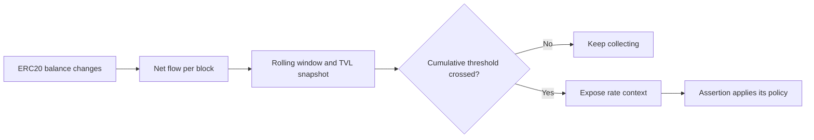

Rate-of-change signals add velocity to cumulative ERC20 circuit breakers. They help distinguish a sudden drain or reserve-stuffing attack from a large movement spread over time, even when both movements reach the same cumulative amount.

<Warning>
Rate-of-change is experimental. Assertions that call `ph.outflowRate()` or `ph.inflowRate()` must register `AssertionSpec.Experimental`; the getters are not available to Legacy or Reshiram assertions.
</Warning>

## Why velocity matters

A cumulative circuit breaker answers **how much value moved** during a rolling window. Rate-of-change also answers **how quickly it moved**.

An amount-only rule treats a scheduled migration and an exploit the same way if both cross its threshold. The rate signal gives the assertion more context after that threshold is crossed: a gradual movement has a lower peak rate, while a concentrated movement produces a spike.

This adds several useful properties:

- **Fewer false positives:** An assertion can apply a different response to a slow migration or scheduled redemption than to a rapid drain.
- **Burst sensitivity:** The peak retains the fastest in-window block even if later activity slows down.
- **Comparable thresholds:** Rates are normalized against the token balance at the start of the window, so policies can use basis points instead of raw token amounts.
- **No additional accounting:** The rate values are calculated from the same flow buckets used by the cumulative breaker. They do not require another trigger or another set of stored buckets.
- **Coverage in both directions:** Outflow rates help identify fast drains, while inflow rates help identify rapid donations, reserve stuffing, or other suspicious balance increases.

## How the signal is calculated

1. The cumulative-flow trigger collects the adopter's ERC20 balance changes into one bucket per block. Multiple changes in the same block are combined.
2. For an outflow breaker, inflow offsets outflow within each bucket. For an inflow breaker, outflow offsets inflow. A net movement in the opposite direction is treated as zero for that direction's rate.
3. The executor keeps the buckets that fall inside the rolling window. The adopter's token balance immediately before the earliest in-window bucket becomes the TVL snapshot.
4. The cumulative breaker compares the net flow across the window with its configured percentage of that snapshot.
5. When the cumulative threshold is crossed, `ph.outflowRate()` or `ph.inflowRate()` exposes rate statistics to the triggered assertion. The assertion decides how to respond.

The rate is expressed as basis points of the TVL snapshot per second:

`rate = floor(net directional flow × 10,000 ÷ (TVL snapshot × seconds))`

Per-block peak and latest rates use a fixed 10-second normalization period. For example, moving the entire TVL snapshot in one block produces approximately `1,000 bps/s`, regardless of the chain's actual block interval.

## Available rate signals

| Field | What it measures | What it helps identify |
| --- | --- | --- |
| `peakRateBps` | Highest net rate among the in-window block buckets | A burst that would be hidden by an average |
| `lastRateBps` | Net rate of the most recent in-window bucket | Whether the latest activity remains elevated or has slowed |
| `meanRateBps` | Cumulative net flow divided by the active span from the first bucket through the latest bucket, plus the 10-second normalization period | The overall pace of the observed movement without diluting it across an otherwise quiet nominal window |

The returned context also includes the token, TVL snapshot, and window boundaries. Calling a rate getter outside its matching cumulative-flow trigger returns a zeroed context; `token == address(0)` indicates that no matching flow trigger fired.

## Fast and gradual flows

Suppose a breaker observes a TVL snapshot of 100,000 tokens. Each of the following cases produces a cumulative outflow of 10,000 tokens, or 1,000 basis points of the snapshot:

| Flow pattern | Cumulative outflow | Peak rate |
| --- | ---: | ---: |
| 10,000 tokens in one block | 1,000 bps | 100 bps/s |
| 1,000 tokens in each of ten blocks over 100 seconds | 1,000 bps | 10 bps/s |

A cumulative threshold can activate the assertion for both cases. A rate-aware policy can then escalate the first case because its peak is higher while applying a different response to the second.

## Related documentation

- [ERC20 Cumulative Outflow Breaker](./ass20-erc20-drain)
- [ERC20 Cumulative Inflow Breaker](./ass22-erc20-inflow-breaker)
- [`outflowRate` and `inflowRate` reference](../../credible/cheatcodes-reference#circuit-breaker-context)
- [Backtesting assertions](../../credible/backtesting)
