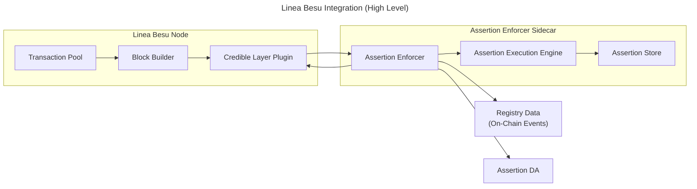

This page summarizes the Linea integration pattern at a high level. It focuses on interface boundaries
and the enforcement flow without internal implementation details.

## Integration Pattern

Linea uses a **plugin pattern** that integrates directly with the Besu node through its plugin system
and delegates assertion execution to a sidecar process.

Key characteristics:

- **Plugin-based enforcement**: Besu plugins hook into block building to validate transactions
- **Sidecar execution**: Assertions run in the Credible Layer sidecar alongside the node
- **Low-latency flow**: Validation happens during block building and returns a valid/invalid decision

## System Overview

## Validation Flow

1. The block builder selects a candidate transaction.
2. The plugin sends the transaction to the sidecar for assertion validation.
3. The sidecar executes applicable assertions and returns a decision.
4. The block builder includes valid transactions and drops invalid ones.

## Notes

- The plugin uses Besu’s transaction selection hooks to validate transactions during block building.
- The sidecar relies on registry data (from on-chain events) and assertion data to determine applicable assertions.
- This integration does not change core protocol rules; it runs alongside the existing block builder.

## Related Docs

- [Network Integration Overview](/credible/network-integration)
- [Assertion Enforcer](/credible/assertion-enforcer)
- [Assertion DA](/credible/assertion-da)
- [OP Stack](/credible/architecture-op-stack)
