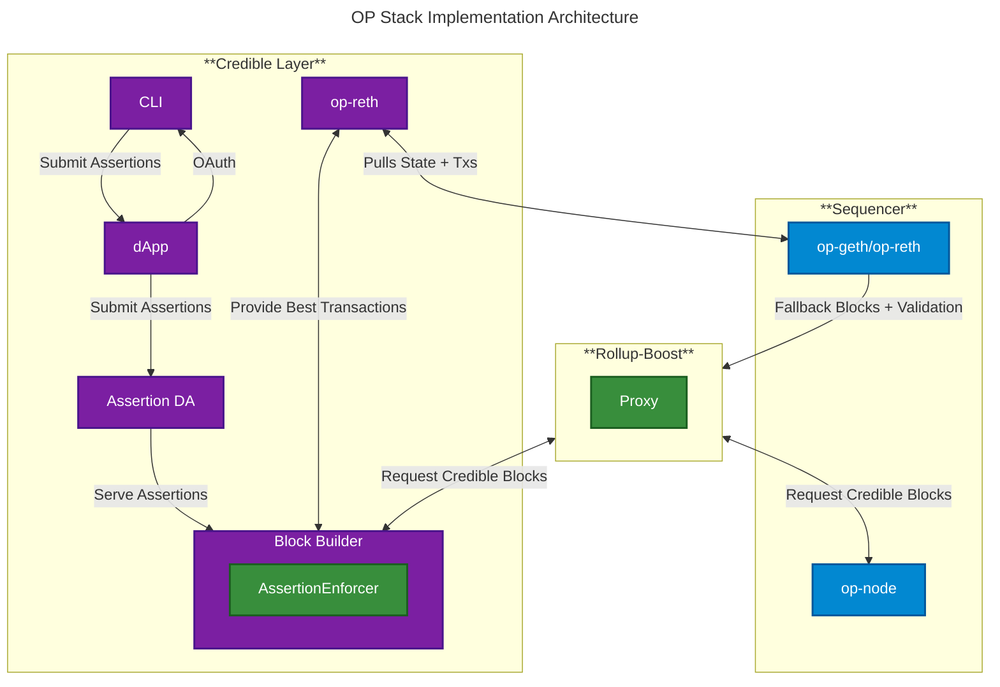
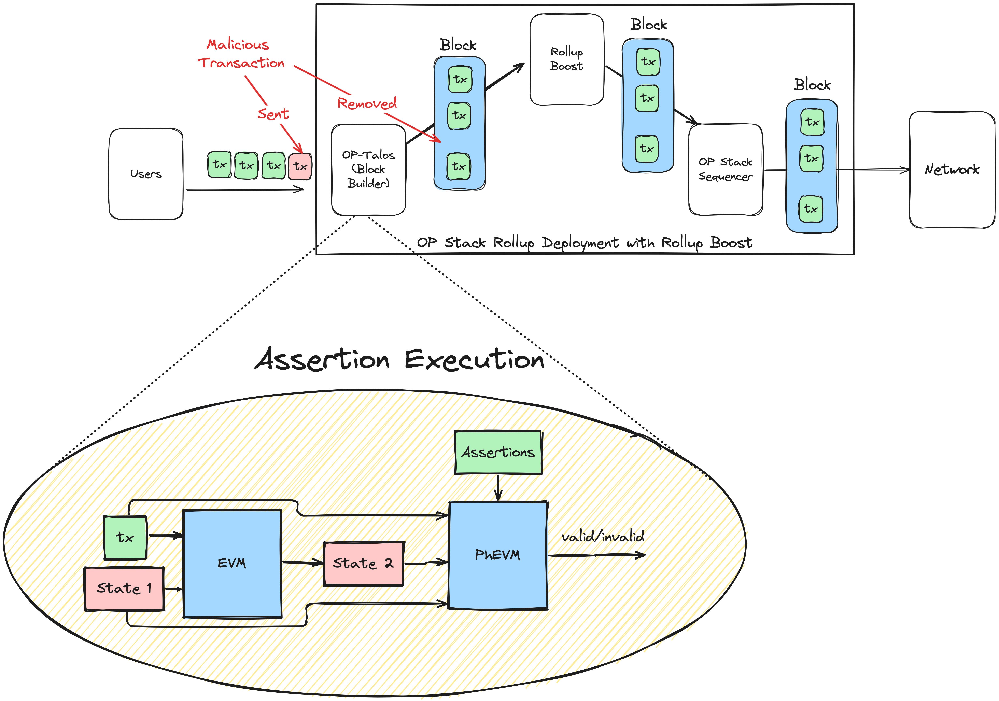

The OP Stack implementation uses [Rollup-Boost](https://github.com/flashbots/rollup-boost) to connect an external sidecar assertion validation components with the L2 sequencer through a bridge proxy.

<Note>
For the general integration path, see [Network Integration Overview](/credible/network-integration).
</Note>

## Architecture Diagram

## System Components

### Sequencer
- **op-node**: The main orchestrator node in the OP Stack, responsible for sequencing transactions and maintaining consensus with the execution layer.
- **op-geth/op-reth**: The execution layer clients (Geth or Reth) that process and execute transactions, providing the EVM environment for the rollup.

### Credible Layer (Sidecar)
- **[Block Builder](/credible/glossary#block-builder)**: The component of the network that simulates transactions and runs assertions before transaction finalization to ensure they don't violate defined conditions.
- **op-reth**: The execution layer client within the Credible Layer that processes transactions and maintains state.
- **[`pcl` CLI](/credible/glossary#pcl-cli)**: Command-line interface for developers to write, test, and submit assertions to the system.
- **[dApp](/credible/glossary#credible-dapp)**: The web application interface to deploy, manage, and view assertions and projects.
- **[Assertion DA](/credible/glossary#assertion-da-data-availability)**: The Assertion Data Availability layer, which stores assertion bytecode and serves it to both end-users and the Assertion Enforcer for execution.

### Rollup-Boost
- **Proxy**: Acts as a bridge between the block builder and the sequencer, enabling integration without requiring changes to the sequencer code. It handles new block requests and fallback validation.

## Component Interactions

- The Credible Layer op-reth pulls state and transactions from the Sequencer op-geth/op-reth.
- The Credible Layer op-reth provides best transactions to the Block Builder.
- The Block Builder enforces assertions and produces credible blocks, which are requested by Rollup-Boost.
- Rollup-Boost requests credible blocks from both the Block Builder and the Sequencer op-node.
- The Assertion DA serves assertion bytecode to the Block Builder, ensuring up-to-date enforcement.
- `pcl` and the Credible dApp provide interfaces for assertion development, submission and management.

## Transaction Flow

The diagram above illustrates transaction flow through the OP Stack implementation. The top section shows the complete deployment: users submit transactions that flow through OP-Talos (block builder) → Rollup-Boost → OP Stack Sequencer → Network. Malicious transactions are identified and removed before reaching the sequencer.

The bottom section zooms into **assertion execution** - this process is consistent across all Credible Layer implementations, not just OP Stack. The transaction and State 1 (pre-state) flow into the EVM for simulation, producing State 2 (post-state). PhEVM then validates these states against deployed assertions, returning valid/invalid.

## Key Technologies

- **OP-Talos**: Implementation of [rbuilder](https://github.com/flashbots/rbuilder) as the Assertion Enforcer. rbuilder is Flashbots' open-source block builder, which we've adapted to include assertion validation logic for the OP Stack.
- [**Rollup-Boost**](https://github.com/flashbots/rollup-boost): Developed by Flashbots, Rollup-Boost is a proxy architecture that enables external block builders to integrate with rollup sequencers. It integrates OP-Talos with the Sequencer without requiring code changes to the Sequencer, allowing for modular and non-invasive assertion enforcement.

## Integration Benefits

This solution provides several advantages for OP Stack networks:

1. **Non-invasive**: No modifications required to the sequencer code
2. **Modular**: Assertion validation runs as a separate, upgradable component
3. **Performant**: Parallel assertion execution doesn't impact sequencer performance
4. **Flexible**: Easy to enable/disable assertion enforcement

For more details on the general architecture and other implementations, see the [Architecture Overview](/credible/architecture-overview).
