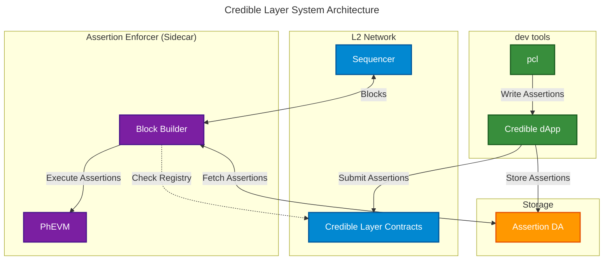
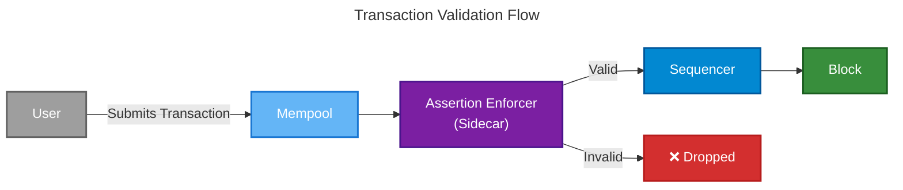
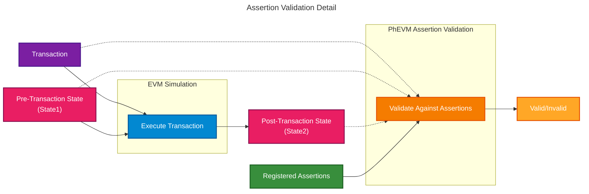

# Introduction

This page provides a comprehensive overview of the architecture of the Credible Layer. It details the primary system components, their roles, and how they interact to enforce security rules for smart contracts.

<Note>
Looking for a non-technical introduction? Start with the [Credible Layer Overview](/credible/credible-layer-overview).
</Note>

# System Overview

The Credible Layer consists of four key components working together:

1. **[Assertions](/credible/glossary#assertion)**: Security rules written in Solidity that define states that should never occur (e.g., "proxy implementation address shouldn't change", "price reported by oracle shouldn't deviate more than x% inside of a single transaction")
2. **Protocols / dApps**: Define assertions for their contracts and link them on-chain
3. **[Block Builders](/credible/glossary#block-builder)/[Sequencers](/credible/glossary#sequencer)**: The network infrastructure that validates every transaction against assertions before inclusion in a block, dropping any that would violate security rules
4. **[Transparency Dashboard](/credible/glossary#transparency-dashboard)**: A platform where users can see which protocols are protected and how, creating a focal point for ecosystem security

# How the Credible Layer Works

## Abstract Overview

The Credible Layer is a **sidecar security infrastructure** that validates every transaction against developer-defined security rules (assertions) before they are included in blocks. As a sidecar, it runs alongside the L2 network's main components, intercepting transactions during the block building process and ensuring they don't violate any registered security properties.

### Sidecar Architecture

The sidecar pattern allows the Credible Layer to:
- **Operate independently** from the main L2 infrastructure
- **Validate transactions** without modifying core L2 code
- **Scale separately** from the main network components
- **Fail gracefully** without affecting L2 operations

### System Architecture

The diagram above shows the Credible Layer at the **system level**. It illustrates two main flows:

**Development Flow**: Developers use the `pcl` to write and test assertions, then submit them via the Credible dApp. The dApp stores assertion bytecode in Assertion DA and submits the assertions to the on-chain Credible Layer contracts.

**Runtime Flow**: The Assertion Enforcer sidecar intercepts transactions from the Sequencer. The Block Builder fetches relevant assertions from Assertion DA, executes them via PhEVM, and only forwards valid transactions back to the Sequencer for block inclusion.

### How It Works

1. **Assertion Registration**: Developers write and submit assertions through the CLI/dApp, which are stored in Assertion DA
2. **Transaction Selection**: The block builder (Assertion Enforcer) picks transactions from the mempool
3. **Assertion Validation**: Each transaction is simulated and validated against relevant assertions using PhEVM
4. **Block Building**: Only transactions that pass all relevant assertions are included in the block
5. **Security Enforcement**: Invalid transactions are dropped, preventing security violations before they reach the blockchain

## Transaction Flow

When a user submits a transaction, it goes through the following validation process:

1. **Transaction Submission**: User submits a transaction to the network
2. **Mempool Entry**: Transaction enters the mempool awaiting selection
3. **Block Builder Selection**: The block builder picks transactions from the mempool and validates them
4. **Assertion Validation**: Each transaction is simulated and validated against registered [Assertions](/credible/glossary#assertion)
5. **Inclusion Decision**: Valid transactions are included in the block, invalid ones are dropped

The diagram below shows the **transaction validation process** during block building:

This diagram shows the **validation flow** for a single transaction. Users submit transactions to the mempool, where the Assertion Enforcer (sidecar) validates them. Valid transactions flow to the sequencer for block inclusion, while invalid transactions are dropped before reaching the blockchain.

### Assertion Validation Process

The assertion validation step (step 4 above) is where the Credible Layer's security enforcement happens. Here's what occurs during this critical phase:

1. **Identify Relevant Assertions**: The system identifies which assertions apply to the contracts the transaction interacts with
2. **Fetch Assertion Bytecode**: The system retrieves [Assertion Bytecode](/credible/glossary#assertion-bytecode) from the [Assertion DA](/credible/glossary#assertion-da-data-availability)
3. **Simulate Transaction**: The transaction is simulated to create two state snapshots:
   - [Pre-transaction state](/credible/glossary#pre-statepost-state): The blockchain state before the transaction
   - [Post-transaction state](/credible/glossary#pre-statepost-state): The blockchain state after the transaction
4. **Execute Assertions**: The [PhEVM](/credible/glossary#phevm-phylax-evm) executes all relevant assertions against these states
5. **Return Result**:
   - If any assertion reverts (invalid state), the transaction is flagged as invalid
   - If all assertions pass, the transaction is considered valid

The diagram below shows the **assertion validation components and data flow**:

This diagram shows the **components involved** in assertion validation. The transaction is first simulated to generate state snapshots, then PhEVM executes assertion bytecode against those states to determine validity.

**Ultimately**: If a transaction would result in a hack and the contract is protected by the Credible Layer, the transaction will be dropped. If the contract is not protected, the transaction will be included in the block.

<Note>
**Forced Inclusion Transactions**: You might be wondering how the Credible Layer handles forced inclusion transactions. We have found a solution and are actively working on implementing it. Ask us about it!
</Note>

## System Components

### Component Details

The Credible Layer consists of several key infrastructure components:

#### Assertion Enforcer (Sidecar)

- Custom [block builder](/credible/glossary#block-builder) implementation that operates as a sidecar to the [sequencer](/credible/glossary#sequencer)
- Integrates with the sequencer without requiring sequencer code modifications
- Orchestrates the validation process by:
  - Identifying which assertions apply to incoming transactions
  - Invoking [PhEVM](/credible/glossary#phevm-phylax-evm) to execute the assertions against transaction states
  - Making inclusion/exclusion decisions based on assertion results
- Builds blocks that exclude any transactions violating assertions
- Handles [forced inclusion transactions](/credible/glossary#forced-inclusion-transactions) with special mitigation pathways

#### PhEVM (Phylax EVM)

The execution arm of the Assertion Enforcer:

- Executes assertion bytecode in an isolated off-chain environment
- Supports special [cheatcodes](/credible/cheatcodes-reference) (precompiles) for efficient state access and comparison
- Can simulate both pre-transaction and post-transaction states
- Evaluates assertions in parallel to maximize throughput (we've benchmarked 1 gigagas/s of assertions against 30 megagas/s transaction throughput)

#### Assertion Data Availability (Assertion DA)

- Compiles and stores assertion source code and bytecode securely
- Provides assertion code to block builders for enforcement
- Enables transparency by making assertions publicly available to users and auditors

#### Credible Layer Protocol

Smart contracts that manage the on-chain assertion registry:

- Maps assertions to protected contracts
- Handles assertion registration, updates, and deactivation
- Supports proof verification for mitigation triggers
- Maintains security parameters and protocol metadata

### Developer Tools

#### Credible Layer dApp

User interface for protocols to register and manage [assertions](/credible/glossary#assertion):

- **[Transparency Dashboard](/credible/glossary#transparency-dashboard)**: Shows every project's assertions and security measures to end users, eliminating blind trust in allocation decisions
- OAuth-based authentication for assertion submission
- Project and assertion management interface

*Screenshot of the Credible Layer dApp UI for a project*

#### `pcl` CLI

Command-line tool for writing, testing, and deploying assertions:

- Write assertions in Solidity
- Test assertions locally with `pcl test`
- Deploy assertions to the Credible Layer
- Manage assertion lifecycle

Learn more in the [`pcl` reference](/credible/pcl-reference-guide).

#### `credible-std`

Standard library exposing [cheatcodes](/credible/glossary#cheatcodes) and testing functionality:

- Provides access to [PhEVM](/credible/glossary#phevm-phylax-evm) cheatcodes for assertion development
- Testing utilities for local assertion validation
- Helper functions for common assertion patterns

See the [`credible-std` reference](/credible/credible-std-overview) for details.

## Implementation Approaches

The Credible Layer can be implemented on different networks using various architectural patterns. The core concepts remain the same, but implementation details vary by network architecture.

### Rollup-Boost Pattern
- Block builder that integrates assertion enforcement directly
- Uses external sidecar components to integrate with the L2 sequencer
- Minimal changes to L2 node code
- Suitable for modular L2 architectures

The core concept remains the same across all implementations: the Credible Layer acts as a **sidecar system** that operates alongside the main L2 infrastructure, providing security validation without interfering with core L2 operations.

For specific implementation details, see:
- [OP Stack Implementation](/credible/architecture-op-stack)

## User Flows

The Credible Layer serves three primary user groups:

### Protocol Teams

1. Install the `pcl` CLI tool
2. Write assertions in Solidity to protect their protocol
3. Test assertions locally using `pcl test`
4. Register assertions to contracts through the Credible Layer dApp
5. Monitor security posture through the dashboard

### End Users

1. View which protocols have Credible Layer protection through the dashboard
2. Verify the specific security rules protecting their funds
3. Confidently deploy capital, knowing malicious transactions that would result in exploits are prevented

### Network Operators

1. Run the Assertion Enforcer sidecar alongside your sequencer
2. Configure integration with your infrastructure (see network-specific implementations)
3. All transactions will automatically be validated against registered assertions

## Network-Specific Implementations

The Credible Layer can be implemented on different networks using various architectural patterns. The core concepts remain the same, but implementation details vary by network architecture.

For detailed network-specific implementation information:
- [OP Stack Implementation](/credible/architecture-op-stack)
- Future network integrations (coming soon)

# Stage 2 Architecture

Stage 2 will be dedicated to solving forced inclusion in L2 networks. We have a solution in development to address this, and more information will be provided as the design and implementation mature.

---

For concrete assertion examples and real-world use cases, explore the [Assertions Book](/assertions-book/assertions-book-intro).

## Next Steps

Ready to start building with the Credible Layer?

<CardGroup cols={2}>
  <Card title="Quickstart Guide" icon="rocket" href="/credible/pcl-quickstart">
    Write and deploy your first assertion
  </Card>
  <Card title="Installation" icon="download" href="/credible/credible-install">
    Set up your development environment
  </Card>
  <Card title="Assertion Guide" icon="code" href="/credible/pcl-assertion-guide">
    Comprehensive guide to writing assertions
  </Card>
  <Card title="Cheatcodes Reference" icon="book" href="/credible/cheatcodes-reference">
    Detailed reference for assertion functions
  </Card>
</CardGroup>
