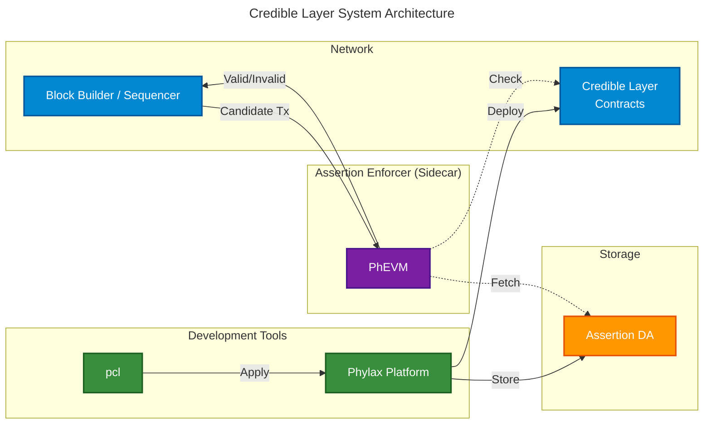
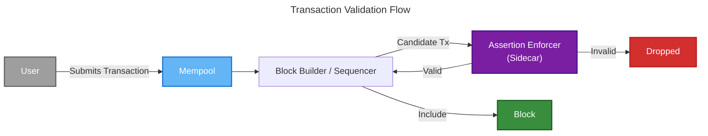
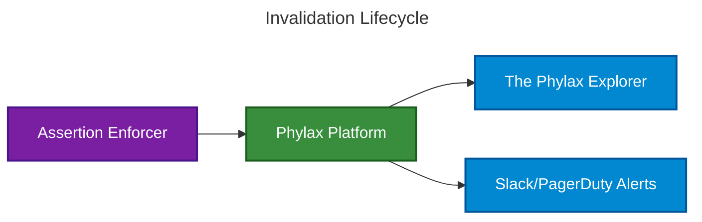

This page provides an overview of the Credible Layer architecture, how the components fit together and interact to enforce security rules for smart contracts.

<Note>
Looking for a non-technical introduction? Start with the [Credible Layer Overview](/credible/credible-layer-overview).
</Note>

## System Overview

The Credible Layer consists of four core components:

1. **[Assertions](/credible/assertions-overview)**: Security rules written in Solidity that define states that should never occur
2. **[Assertion Enforcer](/credible/assertion-enforcer)**: Sidecar that validates transactions against assertions during block production
3. **[Credible Layer Contracts](/credible/credible-layer-contracts)**: On-chain registry that maps assertions to protected contracts
4. **[Assertion DA](/credible/assertion-da)**: Storage layer for assertion bytecode and source code

## How the Credible Layer Works

The Credible Layer is a **sidecar security infrastructure** that validates transactions against developer-defined security rules (assertions) before they are included in blocks. As a sidecar, it runs alongside the L2 network's main components, intercepting transactions during block building and ensuring they don't violate any deployed security rules.

The Assertion Enforcer is operated by the network's block builder or sequencer. Networks that integrate the Credible Layer run this sidecar as part of their block production infrastructure. This means enforcement does not rely on external execution services beyond the network you already trust to include transactions.

### System Architecture

The diagram shows two main flows:

**Development Flow**: Developers use [`pcl`](/credible/apply-assertions) to develop, test, and deploy assertions. Running `pcl apply` compiles assertion code and creates a release on the [Phylax platform](https://app.phylax.systems), which handles storing it in [Assertion DA](/credible/assertion-da). The platform deploys assertions to the on-chain [Credible Layer Contracts](/credible/credible-layer-contracts) so they can be enforced by the network.

**Runtime Flow**: The block builder or sequencer sends transactions to the [Assertion Enforcer](/credible/assertion-enforcer) during block production. The enforcer uses its registry snapshot (from on-chain events) and cached assertion bytecode (from [Assertion DA](/credible/assertion-da)) to execute relevant assertions via [PhEVM](/credible/phevm). Valid transactions are included in blocks; invalid transactions are dropped.

### How It Works

1. **Assertion Deployment**: Developers write assertions and deploy them via `pcl apply`, which creates a release on the platform. The platform stores assertion bytecode in Assertion DA and deploys on-chain
2. **Transaction Validation**: The network sends transactions to the Assertion Enforcer during block production
3. **Assertion Execution**: The Assertion Enforcer simulates each transaction and validates it against relevant assertions using PhEVM
4. **Validation Results**: The Assertion Enforcer returns valid/invalid results to the block builder or sequencer
5. **Security Enforcement**: Only valid transactions are included in blocks, preventing security violations before they reach the blockchain

## Transaction Flow

When a user submits a transaction, it goes through the following validation process:

1. **Transaction Submission**: User submits a transaction to the network
2. **Mempool Entry**: Transaction enters the mempool awaiting selection
3. **Block Builder Selection**: The block builder picks transactions from the mempool
4. **Assertion Validation**: Each transaction is validated against deployed assertions
5. **Inclusion Decision**: Valid transactions are included in the block, invalid ones are dropped

<Note>
The Assertion Enforcer is integrated with the block builder. During block production, the block builder invokes the Assertion Enforcer to validate transactions before including them.
</Note>

## Invalidation Lifecycle (Public View)

When an assertion is violated, the invalidation is recorded and exposed for transparency and alerts.

## Integration Paths

<CardGroup cols={2}>
  <Card title="Plan a Platform Integration" icon="browser" href="/credible/dapp-integration">
    How protocols deploy and manage assertions
  </Card>
  <Card title="Network Integration Overview" icon="sitemap" href="/credible/network-integration">
    How networks and sequencers integrate enforcement
  </Card>
  <Card title="Interface Overview" icon="diagram-project" href="/credible/interfaces-overview">
    High-level component boundaries and dependencies
  </Card>
</CardGroup>

For details on the assertion validation process, see [Assertion Enforcer](/credible/assertion-enforcer#validation-process).

## System Components

### Assertion Enforcer

The [Assertion Enforcer](/credible/assertion-enforcer) is a sidecar that orchestrates transaction validation. It identifies which assertions apply to incoming transactions, invokes PhEVM to execute them, and makes inclusion/exclusion decisions based on the results.

### PhEVM (Phylax EVM)

[PhEVM](/credible/phevm) is the execution engine that runs assertion bytecode. It extends the standard EVM with [cheatcodes](/credible/glossary#cheatcodes) for state inspection, enabling assertions to compare pre-transaction and post-transaction states.

### Assertion DA

[Assertion Data Availability](/credible/assertion-da) stores assertion bytecode and source code, making them accessible to Assertion Enforcers and providing transparency for users and auditors.

### Credible Layer Contracts

The [Credible Layer Contracts](/credible/credible-layer-contracts) are on-chain smart contracts that manage the assertion registry. The State Oracle coordinates protocol admins with network operators and serves as the source of truth for which assertions protect which contracts.

### Developer Tools

- **[Phylax platform](https://app.phylax.systems)**: Web interface for deploying, managing, and viewing assertions
- **[`pcl`](/credible/apply-assertions)**: Command-line tool for writing, testing, and deploying assertions
- **[`credible-std`](/credible/credible-std-overview)**: Standard library exposing cheatcodes and testing utilities

## Network Integrations

The Credible Layer can be implemented on different networks. The core concepts remain the same, but implementation details vary by network architecture.

For specific implementation details, see:
- [OP Stack Implementation](/credible/network-integrations/architecture-op-stack)

---

For concrete assertion examples and real-world use cases, explore the [Assertions Book](/assertions-book/assertions-book-intro).

## Next Steps

<CardGroup cols={2}>
  <Card title="Quickstart Guide" icon="rocket" href="/credible/pcl-quickstart">
    Write and deploy your first assertion
  </Card>
  <Card title="Installation" icon="download" href="/credible/credible-install">
    Set up your development environment
  </Card>
  <Card title="Assertion Guide" icon="code" href="/credible/write-first-assertion">
    Comprehensive guide to writing assertions
  </Card>
  <Card title="Cheatcodes Reference" icon="book" href="/credible/cheatcodes-reference">
    Detailed reference for assertion functions
  </Card>
  <Card title="Trust Model" icon="shield-check" href="/credible/trust-model">
    Guarantees, scope, and operational model
  </Card>
</CardGroup>
