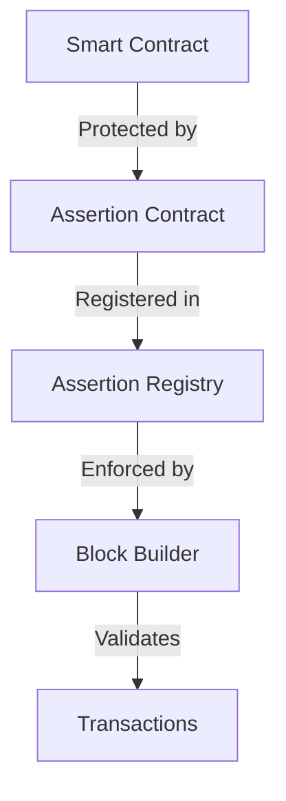
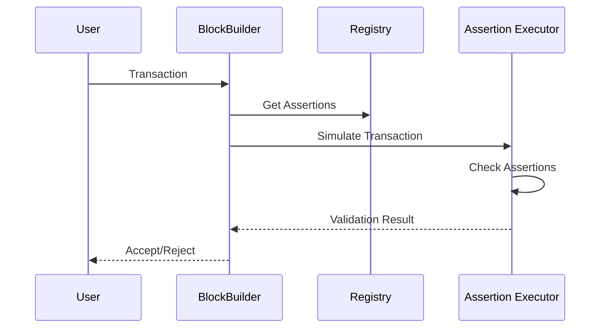

The Credible Layer is a protocol-level security infrastructure that enforces security rules for smart contracts through on-chain assertions. This document details the technical architecture and components.

## Core Components

### 1. Assertion Protocol

The assertion protocol defines the mechanism for registering and enforcing security rules:

Key Protocol Elements:
- Assertion contracts define security invariants
- Registry maintains assertion mappings and metadata
- Block builder enforces assertions during transaction processing

### 2. Transaction Verification

The verification system processes transactions through the following steps:

Verification Process:
1. Transaction submission
2. Assertion retrieval
3. State simulation
4. Assertion validation
5. Transaction acceptance/rejection

### 3. Block Builder Integration

The block builder component:
- Processes incoming transactions
- Retrieves relevant assertions
- Simulates transaction execution
- Enforces assertion rules
- Constructs valid blocks

## Forced Inclusion

The Credible Layer implements forced inclusion to ensure all transactions are validated against assertions:

1. **Transaction Processing**
   - All transactions must pass through the block builder
   - No direct transaction inclusion is possible
   - Block builder must validate against all relevant assertions

2. **Block Construction**
   - Only validated transactions can be included in blocks
   - Invalid transactions are rejected at the block builder level
   - Block builders must implement the verification protocol

3. **Network Enforcement**
   - Network nodes verify block builder compliance
   - Blocks containing unverified transactions are rejected
   - Economic incentives ensure protocol adherence

## State Management

The system maintains three critical states:

1. **Pre-transaction State**
   - Captured before transaction execution
   - Used for state comparison
   - Stored temporarily during verification

2. **Post-transaction State**
   - Simulated transaction execution
   - Compared against pre-state
   - Validated against assertions

3. **Registry State**
   - Maintains assertion mappings
   - Tracks assertion versions
   - Manages assertion metadata

## Performance Optimizations

1. **State Management**
   - Efficient state capture and comparison
   - Minimal storage overhead
   - Optimized state access patterns

2. **Verification Process**
   - Parallel assertion checking
   - Early rejection of invalid transactions
   - Cached assertion retrieval

3. **Block Building**
   - Batched transaction processing
   - Optimized assertion selection
   - Efficient state transitions

## Security Properties

1. **Isolation**
   - Assertions run in isolated environments
   - No interference between assertions
   - Protected state access

2. **Determinism**
   - Consistent verification results
   - Reproducible state transitions
   - Predictable behavior

3. **Transparency**
   - Public assertion code
   - Verifiable security rules
   - Open validation process
