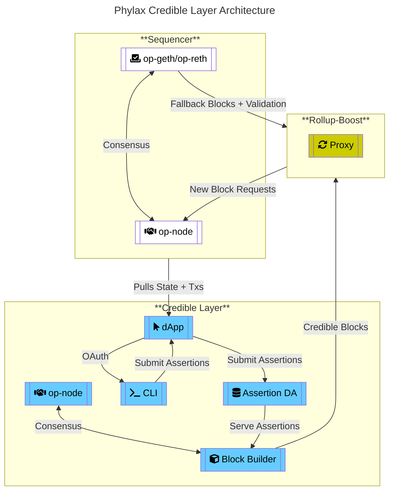
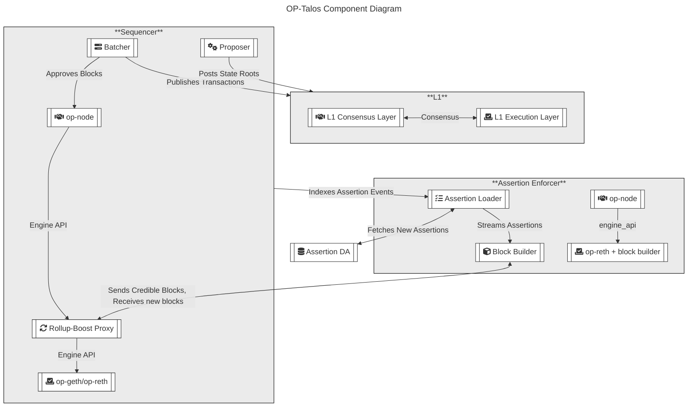

# Introduction

This page provides a comprehensive overview of the architecture of the Credible Layer. It details the primary system components, their roles, and how they interact to enforce security rules for smart contracts. The document includes architectural diagrams, step-by-step flow explanations, and descriptions of supporting infrastructure.

# Stage 1 Architecture

### System Elements Explained

- **[Sequencer](/credible/glossary#sequencer)**
  - **op-node**: The main orchestrator node in the OP Stack, responsible for sequencing transactions and maintaining consensus with the execution layer.
  - **op-geth/op-reth**: The execution layer clients (Geth or Reth) that process and execute transactions, providing the EVM environment for the rollup.

- **[Credible Layer](/credible/glossary#pcl-phylax-credible-layer)**
  - **[Block Builder](/credible/glossary#block-builder)**: The implementation of the [Assertion Enforcer](/credible/glossary#assertion-enforcer) role, responsible for constructing blocks, enforcing assertions, and ensuring only valid transactions are included.
  - **op-node**: A node within the Credible Layer that participates in consensus and interacts with the block builder.
  - **[pcl CLI](/credible/glossary#pcl-cli)**: Command-line interface for developers to write, test, and submit assertions to the system.
  - **[dApp](/credible/glossary#credible-dapp)**: The web application interface to register, manage, and view assertions and projects.
  - **[Assertion DA](/credible/glossary#assertion-da-data-availability)**: The Assertion Data Availability layer, which stores assertion bytecode and serves it to both end-users and the Assertion Enforcer for execution.

- **Rollup-Boost**
  - **Proxy**: Acts as a bridge between the block builder and the sequencer, enabling integration without requiring changes to the sequencer code. It handles new block requests and fallback validation.

**Interactions:**
- The Sequencer pulls state and transactions from the Credible Layer dApp.
- The Block Builder (Assertion Enforcer) enforces assertions and produces credible blocks, which are passed to Rollup-Boost.
- Rollup-Boost proxies block requests and validation between the block builder and the sequencer.
- The Assertion DA serves assertion bytecode to the Block Builder, ensuring up-to-date enforcement.
- The pcl CLI and Credible dApp provide interfaces for assertion submission and management.

## Transaction Flow

The following diagram illustrates the transaction flow through the Credible Layer. Each step is explained in detail below:

1. User submits a transaction to the network.
2. Transaction enters the Mempool.
3. [OP-Talos](/credible/glossary#op-talos) receives the transaction for potential inclusion in a block.
4. For each transaction, OP-Talos:
    - References the [Assertions](/credible/glossary#assertion) stored in the [Credible Layer](/credible/glossary#pcl-phylax-credible-layer) that are related to the contracts the transaction interacts with.
    - Fetches [Assertion Bytecode](/credible/glossary#assertion-bytecode) from the [Assertion DA](/credible/glossary#assertion-da-data-availability).
    - The [PhEVM](/credible/glossary#phevm-phylax-evm):
        - Simulates transaction execution.
        - Creates [pre-transaction state](/credible/glossary#pre-statepost-state) and [post-transaction state](/credible/glossary#pre-statepost-state) snapshots.
        - Executes all relevant assertions against these transactions.
    - The PhEVM returns assertion results:
        - If any assertion reverts (invalid state), the transaction is flagged as invalid.
        - If all assertions pass, the transaction is considered valid.
5. OP-Talos makes inclusion decisions:
    - Invalid transactions are not included in the block.
    - Valid transactions are included in the block.
6. OP-Talos submits the validated block to the sequencer via Rollup-Boost.
7. The sequencer accepts and processes the validated block.

## Auxiliary Components

- **[Assertion DA](/credible/glossary#assertion-da-data-availability)**: A centralized server that is operated by Phylax Systems Inc and is responsible for storing the Assertion bytecode, so that it's available to both end-users for inspection as also to the Assertion Enforcer for execution. The Assertion ID is derived by hashing the bytecode. This component will be decentralized in the future.

- **[pcl CLI](/credible/glossary#pcl-cli):** The CLI which developers use to develop and test assertions. It is also used to store and submit assertions, so they can be registered on-chain.
    - A quickstart guide for the `pcl` is available [here](/credible/pcl-quickstart).

- **[Credible dApp](/credible/glossary#credible-dapp)**: The dApp that enables end-users and developers to interact with the Credible Layer.
    - It is used by [Assertion Adopters](/credible/glossary#assertion-adopter) to submit and manage their assertions.
    - It is used by end users (consumers) to view the registered dApps and their assertions. It builds trust, as end users know exactly what security properties the dApps they use have.
    - An overview of the dApp is available [here](/credible/dapp-guide).

## Sequencer Components

- **OP-Talos**: Implementation of [rbuilder](https://github.com/flashbots/rbuilder) as the Assertion Enforcer.
- **Rollup-Boost**: Developed by Flashbots, integrates OP-Talos with the Sequencer without code changes to the Sequencer.

*OP-Talos Component Diagram: This diagram shows the interaction between the L1 Layer, Sequencer, Assertion Enforcer, Rollup-Boost Proxy, and Assertion DA in the context of assertion enforcement and block production.*

- **L1 Layer**: Represents the Ethereum mainnet, consisting of the L1 Execution Layer and L1 Consensus Layer. It receives published transactions and state roots from the sequencer.
- **Sequencer**: Composed of the op-node, execution clients (op-geth/op-reth), batcher, and proposer. The sequencer is responsible for building blocks, validating transactions, and interfacing with both the Rollup-Boost Proxy and L1 Layer.
- **Credible Layer (Assertion Enforcer)**: Contains the Block Builder (which enforces assertions), its own op-node and execution layer, and the Assertion Loader. The Assertion Loader fetches new assertions from the Assertion DA and streams them to the Block Builder for enforcement.
- **Rollup-Boost Proxy**: Acts as a bridge between the sequencer and the Assertion Enforcer, handling block requests and validation without requiring changes to the sequencer code.
- **Assertion DA**: The data availability layer that stores assertion bytecode and metadata, making them accessible to the Assertion Loader and Block Builder.

# Stage 2 Architecture

Stage 2 will be dedicated to solving forced inclusion in the OP Stack. We have a solution in development to address this, and more information will be provided as the design and implementation mature.
