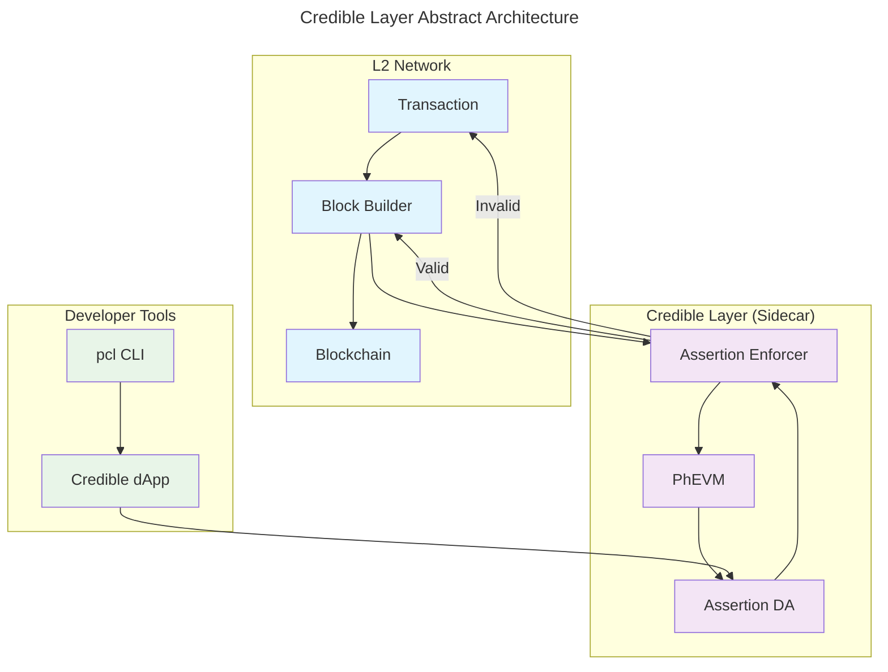
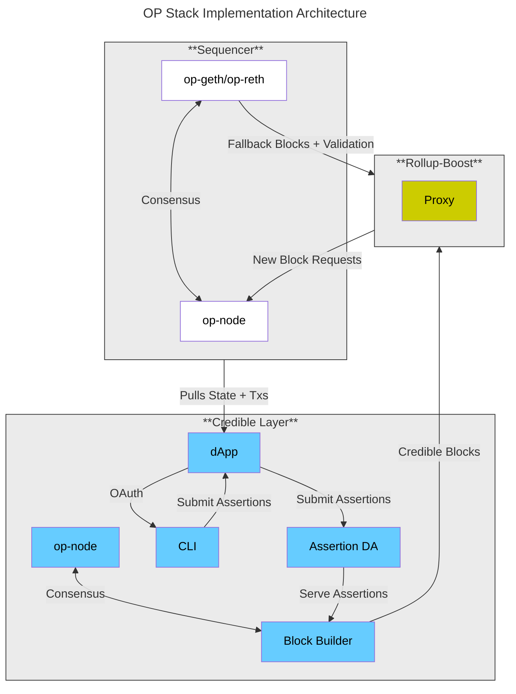
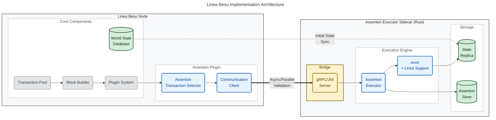

# Introduction

This page provides a comprehensive overview of the architecture of the Credible Layer. It details the primary system components, their roles, and how they interact to enforce security rules for smart contracts. The document includes architectural diagrams, step-by-step flow explanations, and descriptions of supporting infrastructure.

# How the Credible Layer Works

## Abstract Overview

The Credible Layer is a **sidecar security infrastructure** that validates every transaction against developer-defined security rules (assertions) before they are included in blocks. As a sidecar, it runs alongside the L2 network's main components, intercepting transactions during the block building process and ensuring they don't violate any registered security properties.

### Sidecar Architecture

The sidecar pattern allows the Credible Layer to:
- **Operate independently** from the main L2 infrastructure
- **Validate transactions** without modifying core L2 code
- **Scale separately** from the main network components
- **Fail gracefully** without affecting L2 operations

### Core Concept

### Key Components

1. **Assertion DA**: Data availability layer responsible for storing assertion code and metadata, ensuring assertions are accessible and verifiable by anyone
2. **Assertion Enforcer**: The entity responsible for enforcing assertions and vouching for not including any transactions that would invalidate them
3. **PhEVM**: Specialized EVM implementation that includes additional capabilities for assertion verification and state manipulation
4. **Developer Tools**: CLI and web interface for creating, testing, and managing assertions

### How It Works

1. **Assertion Registration**: Developers write and submit assertions that define security properties for their contracts
2. **Transaction Interception**: During block building, transactions are intercepted before inclusion
3. **Assertion Validation**: Each transaction is validated against relevant assertions using PhEVM
4. **Block Inclusion**: Only transactions that pass all relevant assertions are included in blocks
5. **Security Enforcement**: Invalid transactions are rejected, preventing security violations

## Implementation Approaches

The Credible Layer can be implemented using different architectural patterns depending on the L2 network's infrastructure:

### Rollup-Boost Pattern (OP Stack)
- Uses external sidecar components to integrate with the L2 sequencer
- Minimal changes to L2 node code
- Suitable for modular L2 architectures
- **OP-Talos** acts as the assertion validation sidecar

### Plugin Pattern (Linea/Besu)
- Integrates directly as a plugin within the L2 node
- Uses dedicated sidecar processes for assertion execution
- Better performance and tighter integration
- Suitable for L2s with plugin architectures
- **Assertion Executor Sidecar** runs in parallel with the main node

Both patterns implement the Credible Layer as a **sidecar system** that operates alongside the main L2 infrastructure, providing security validation without interfering with core L2 operations.

# Implementation Details

## OP Stack Implementation

The OP Stack implementation uses an **Rollup-Boost Pattern** that connects external sidecar assertion validation components with the L2 sequencer through a bridge proxy.

### OP Stack System Elements

- **[Sequencer](/credible/glossary#sequencer)**
  - **op-node**: The main orchestrator node in the OP Stack, responsible for sequencing transactions and maintaining consensus with the execution layer.
  - **op-geth/op-reth**: The execution layer clients (Geth or Reth) that process and execute transactions, providing the EVM environment for the rollup.

- **[Credible Layer (Sidecar)](/credible/glossary#pcl-phylax-credible-layer)**
  - **[Block Builder](/credible/glossary#block-builder)**: The component of the network that simulates transactions and runs assertions before transaction finalization to ensure they don't violate defined conditions.
  - **op-node**: A node within the Credible Layer that participates in consensus and interacts with the block builder.
  - **[pcl CLI](/credible/glossary#pcl-cli)**: Command-line interface for developers to write, test, and submit assertions to the system.
  - **[dApp](/credible/glossary#credible-dapp)**: The web application interface to register, manage, and view assertions and projects.
  - **[Assertion DA](/credible/glossary#assertion-da-data-availability)**: The Assertion Data Availability layer, which stores assertion bytecode and serves it to both end-users and the Assertion Enforcer for execution.

- **Rollup-Boost**
  - **Proxy**: Acts as a bridge between the block builder and the sequencer, enabling integration without requiring changes to the sequencer code. It handles new block requests and fallback validation.

**Interactions:**
- The Sequencer pulls state and transactions from the Credible Layer dApp.
- The Block Builder (Assertion Enforcer) enforces assertions and produces credible blocks, which are passed to Rollup-Boost.
- Rollup-Boost proxies block requests and validation between the block builder and the sequencer.
- The Assertion DA serves assertion bytecode to the Block Builder, ensuring up-to-date enforcement.
- The pcl CLI and Credible dApp provide interfaces for assertion submission and management.

### OP Stack Sequencer Components

- **OP-Talos**: Implementation of [rbuilder](https://github.com/flashbots/rbuilder) as the Assertion Enforcer.
- **Rollup-Boost**: Developed by Flashbots, integrates OP-Talos with the Sequencer without code changes to the Sequencer.

## Linea/Besu Implementation

The Linea implementation uses a **Plugin Pattern** that integrates directly with the Besu node through its plugin system and uses a sidecar process for assertion execution.

#### System Overview

The integration leverages Besu's plugin system to intercept transactions during block building and validate them against assertions in a separate Rust-based executor. The assertion executor maintains its own state replica by re-executing all transactions with Linea-compatible EVM rules.

#### Architecture Diagram

#### Linea System Components

The system consists of three main components:

1. **Linea Besu Plugin** - A transaction selection plugin that intercepts transactions during block building
2. **Communication Bridge** - JNI or gRPC interface enabling async communication between Java and Rust
3. **Assertion Executor Sidecar** - Parallel Rust process with Linea-compatible EVM that validates assertions

#### Linea Implementation Details

**Autonomous State Management**
The assertion executor maintains its own state by re-executing all Linea transactions independently. This eliminates complex state-sharing APIs between Java (Besu) and Rust (assertion executor) - instead, both systems execute the same transactions and maintain separate state.

**Parallel Execution Model**
Transactions are validated in parallel with Besu's execution, with validation time "hidden" within Besu's processing time. This ensures minimal latency overhead while providing fail-safe operation.

**Plugin-Based Integration**
Uses Besu's `PluginTransactionSelector` interface to intercept transactions during block building without modifying core Besu code. The plugin starts async validation in the pre-processing hook and checks results in the post-processing hook.

## Transaction Flow

The following diagram illustrates the transaction flow through the Credible Layer using the OP Stack implementation as an example. The general flow is very similar across all implementations, with only the specific components and communication patterns differing.

")

#### General Transaction Flow

1. **Transaction Submission**: User submits a transaction to the network.
2. **Mempool Entry**: Transaction enters the mempool for processing.
3. **Assertion Validation**: The assertion validation system receives the transaction for potential inclusion:
    - References the [Assertions](/credible/glossary#assertion) stored in the [Credible Layer](/credible/glossary#pcl-phylax-credible-layer) that are related to the contracts the transaction interacts with.
    - Fetches [Assertion Bytecode](/credible/glossary#assertion-bytecode) from the [Assertion DA](/credible/glossary#assertion-da-data-availability).
    - The [PhEVM](/credible/glossary#phevm-phylax-evm):
        - Simulates transaction execution.
        - Creates [pre-transaction state](/credible/glossary#pre-statepost-state) and [post-transaction state](/credible/glossary#pre-statepost-state) snapshots.
        - Executes all relevant assertions against these transactions.
    - The PhEVM returns assertion results:
        - If any assertion reverts (invalid state), the transaction is flagged as invalid.
        - If all assertions pass, the transaction is considered valid.
4. **Inclusion Decision**: The validation system makes inclusion decisions:
    - Invalid transactions are not included in the block.
    - Valid transactions are included in the block.
5. **Block Finalization**: The validated block is finalized and added to the blockchain.

#### Implementation-Specific Details

The exact mechanism for steps 3-5 varies depending on the implementation pattern:

- **OP Stack (Rollup-Boost Pattern)**: Uses OP-Talos for external block validation and Rollup-Boost for bridge communication
- **Linea/Besu (Plugin Pattern)**: Uses internal plugin validation with dedicated sidecar execution

## Auxiliary Components

- **[Assertion DA](/credible/glossary#assertion-da-data-availability)**: Data Availability layer that is responsible for storing the Assertion bytecode, making it available to both end-users for inspection and to the Assertion Enforcer for execution.

- **[pcl CLI](/credible/glossary#pcl-cli):** The CLI which developers use to develop and test assertions. It is also used to store and submit assertions, so they can be registered on-chain.
    - A quickstart guide for the `pcl` is available [here](/credible/pcl-quickstart).

- **[Credible dApp](/credible/glossary#credible-dapp)**: The dApp that enables end-users and developers to interact with the Credible Layer.
    - It is used by [Assertion Adopters](/credible/glossary#assertion-adopter) to submit and manage their assertions.
    - It is used by end users (consumers) to view the registered dApps and their assertions. It builds trust, as end users know exactly what security properties the dApps they use have.
    - An overview of the dApp is available [here](/credible/dapp-guide).

# Stage 2 Architecture

Stage 2 will be dedicated to solving forced inclusion in L2 networks. We have a solution in development to address this, and more information will be provided as the design and implementation mature.