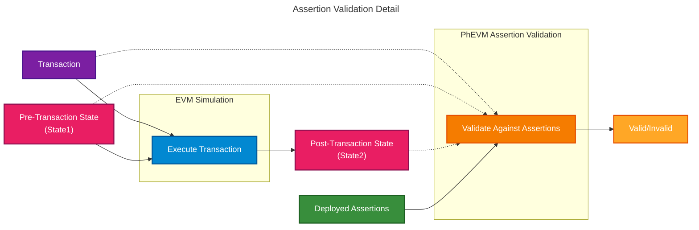

The Assertion Enforcer is a sidecar component that validates transactions against [assertions](/credible/glossary#assertion) during block production. It operates alongside the network's [sequencer](/credible/glossary#sequencer) or [block builder](/credible/glossary#block-builder), intercepting transactions and determining which should be included in blocks.

## Role in the System

The Assertion Enforcer operates inside the block production pipeline:

1. Receives candidate transactions from the block builder or sequencer
2. Identifies which assertions apply to each transaction
3. Invokes [PhEVM](/credible/phevm) to execute assertions against transaction states
4. Returns validation results (valid/invalid) to the network
5. For enforced production paths, only valid transactions are included in blocks

Depending on the network integration, validation can run synchronously before inclusion or through a bounded optimistic path where the builder checkpoints execution, runs assertions in parallel worker capacity, and rolls back if a transaction invalidates.

## Sidecar Architecture

As a [sidecar](/credible/glossary#sidecar), the Assertion Enforcer:

- **Operates independently** from the main L2 infrastructure
- **Integrates alongside block builders** without changing core protocol rules
- **Scales separately** from the main network components
- **Preserves network continuity** by keeping block production policy under the network operator's integration

This design allows networks to adopt the Credible Layer without modifying their core infrastructure.

## Validation Process

When a transaction arrives for validation, the Assertion Enforcer orchestrates the following process:

### Step-by-Step

1. **Identify Relevant Assertions**: The Assertion Enforcer consults registry data (indexed from [on-chain events](/credible/credible-layer-contracts)) to find which assertions apply to the contracts the transaction interacts with

2. **Fetch Assertion Bytecode**: Assertion bytecode is retrieved from internal cache (populated from [Assertion DA](/credible/assertion-da) when assertions are deployed)

3. **Simulate Transaction**: The transaction is executed against pre-transaction state to produce the post-transaction state

4. **Execute Assertions**: [PhEVM](/credible/phevm) runs all relevant assertions with access to:
   - The transaction itself
   - Pre-transaction state (State1)
   - Post-transaction state (State2)

5. **Return Result**:
   - If any assertion reverts → transaction is invalid
   - If all assertions pass → transaction is valid

## Block Building Integration

The Assertion Enforcer integrates with block builders to ensure only valid transactions enter enforced production paths:

- Transactions that would violate assertions are dropped before block inclusion on enforced paths
- The block builder or sequencer receives clear valid/invalid signals
- Block production continues normally with validated transactions

### Invalidation Handling

When an assertion invalidates a candidate transaction, the integration applies the network's documented inclusion policy. In the usual production path, the invalid transaction is excluded before settlement and the platform records an invalidation.

Some integrations may use optimistic execution to keep assertion work out of the serial block-building path. In that model, the builder creates a rollback checkpoint before speculative execution. If a transaction invalidates, the builder rolls back to the checkpoint before that transaction, excludes the invalid transaction, and replays later transactions within the configured speculative window.

Rollback and replay cost must be bounded by policy. Integrations should define the speculative window, publication boundary, timeout behavior, and what happens when assertion workers fall behind.

## Performance Model

The Assertion Enforcer is designed to keep the synchronous block-building path small. In the common case, the block builder pays for routing work such as metadata collection, assertion selection, checkpoint creation, and work submission. Assertion execution itself can run separately from that serial path, depending on the integration.

The hot path should stay limited to the work required to route, schedule, and account for assertion execution:

- collect the trace or metadata needed for assertion routing
- select relevant assertions from the registry snapshot
- create rollback checkpoints where the integration uses optimistic execution
- submit bounded work to assertion workers
- apply the validation result before the publication boundary

The important performance constraint is keeping assertion work bounded and predictable for the transaction workload. Integrations use bounded queues, publication policies, fine-grained triggers, deterministic gas or runtime limits, and bounded execution surfaces to keep validation predictable.

The enforcer also avoids network fetches on the transaction hot path. Assertion bytecode is fetched after deployment events and cached before validation.

The primary performance risk is assertion tail latency. Production monitoring should track trigger rate, p95, p99, and maximum assertion execution time, invalidation behavior, worker backlog, and timeout rates.

## Production Admission and Resource Limits

Production execution uses the active assertion set admitted through the configured registry and review process.

Production assertion admission should account for:

- Protected protocol areas and trigger conditions
- Expected trigger frequency
- Maximum gas or runtime budget
- Expected read footprint
- Deterministic behavior and read-only execution
- Historical backtesting and staging behavior
- Suitability for common acceleration paths, such as compact trace summaries or native helper functions

These controls keep block-building resources predictable and help protocol teams understand which assertions are ready to promote from staging to production.

## Resource Isolation and Griefing Controls

Assertions should not automatically consume production block-building resources just because they were published. Production admission and resource limits protect the network from broad, expensive, or poorly scoped assertions.

Common controls include:

- Authorization or review before an assertion enters the production execution set
- Trigger scoping so assertions run only for relevant contracts, selectors, or state changes
- Runtime and read-footprint limits
- Dedicated worker capacity for assertion execution
- Timeout behavior with clear inclusion-policy consequences
- Staging and backtesting requirements before production promotion

Ingress filtering can also reduce repeated invalid submissions. When a transaction invalidates, the integration can record short-lived fingerprints for exact replays or repeated attempts against the same assertion and target contract or function. Broad fingerprints should use conservative TTLs and thresholds.

## Operational Expectations (Public)

- **Non-invasive**: Runs alongside existing block builders without changing consensus rules
- **Deterministic**: Results are based on on-chain state and assertion code only
- **Staging support**: Networks can validate assertions before enforcing them in production
- **Transparent outcomes**: Invalidations are visible in the platform and The Phylax Explorer

## Assertion Caching

To ensure high-performance validation, the Assertion Enforcer maintains an internal cache of assertion bytecode:

- **On deployment**: When an assertion is deployed on-chain, the Assertion Enforcer detects the event and fetches bytecode from [Assertion DA](/credible/assertion-da)
- **During validation**: Assertions are loaded from cache. No network requests occur on the hot path.

This caching strategy keeps assertion data retrieval out of the block-production hot path.

## Learn More

<CardGroup cols={2}>
  <Card title="Network Integration" icon="sitemap" href="/credible/network-integration">
    High-level integration for networks and sequencers
  </Card>
  <Card title="Trust Model" icon="shield-check" href="/credible/trust-model">
    Guarantees, scope, and operational model
  </Card>
</CardGroup>
