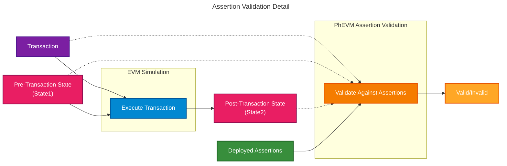

The Assertion Enforcer is a sidecar component that validates transactions against [assertions](/credible/glossary#assertion) during block production. It operates alongside the network's [sequencer](/credible/glossary#sequencer) or [block builder](/credible/glossary#block-builder), intercepting transactions and determining which should be included in blocks.

## Role in the System

The Assertion Enforcer operates inside the block production pipeline:

1. Receives candidate transactions from the block builder or sequencer
2. Identifies which assertions apply to each transaction
3. Invokes [PhEVM](/credible/phevm) to execute assertions against transaction states
4. Returns validation results (valid/invalid) to the network
5. Only valid transactions are included in blocks

## Sidecar Architecture

As a [sidecar](/credible/glossary#sidecar), the Assertion Enforcer:

- **Operates independently** from the main L2 infrastructure
- **Integrates alongside block builders** without changing core protocol rules
- **Scales separately** from the main network components
- **Fails open** so the network can continue producing blocks without Credible Layer enforcement if the enforcer is unavailable

This design allows networks to adopt the Credible Layer without modifying their core infrastructure.

## Validation Process

When a transaction arrives for validation, the Assertion Enforcer orchestrates the following process:

### Step-by-Step

1. **Identify Relevant Assertions**: The Assertion Enforcer consults registry data (indexed from [on-chain events](/credible/credible-layer-contracts)) to find which assertions apply to the contracts the transaction interacts with

2. **Fetch Assertion Bytecode**: Assertion bytecode is retrieved from internal cache (populated from [Assertion DA](/credible/assertion-da) when assertions are deployed)

3. **Simulate Transaction**: The transaction is executed against pre-transaction state to produce the post-transaction state

4. **Execute Assertions**: [PhEVM](/credible/phevm) runs all relevant assertions with access to:
   - The transaction itself
   - Pre-transaction state (State1)
   - Post-transaction state (State2)

5. **Return Result**:
   - If any assertion reverts → transaction is invalid
   - If all assertions pass → transaction is valid

## Block Building Integration

The Assertion Enforcer integrates with block builders to ensure only valid transactions enter blocks:

- Transactions that would violate assertions are dropped before block inclusion
- The block builder or sequencer receives clear valid/invalid signals
- Block production continues normally with validated transactions

## Performance Model

The Assertion Enforcer is designed to keep the synchronous block-building path small. In the common case, the block builder pays for routing work such as metadata collection, assertion selection, checkpoint creation, and work submission. Assertion execution itself can run separately from that serial path, depending on the network integration.

The important performance constraint is that assertion workers must keep up with the transaction workload. If assertion execution falls behind, the system needs bounded backpressure, a publication boundary, or another network-specific policy. This is why assertions should use fine-grained triggers, deterministic gas or runtime limits, and bounded execution surfaces.

The enforcer also avoids network fetches on the transaction hot path. Assertion bytecode is fetched after deployment events and cached before validation.

## Operational Expectations (Public)

- **Non-invasive**: Runs alongside existing block builders without changing consensus rules
- **Deterministic**: Results are based on on-chain state and assertion code only
- **Staging support**: Networks can validate assertions before enforcing them in production
- **Transparent outcomes**: Incidents are visible in the platform and dashboard

## Forced Inclusion Transactions

Forced inclusion transactions, such as L1 to L2 deposits, require network-specific handling because they may have protocol-level inclusion guarantees. A normal block-building rejection path may not be enough for those transactions.

<Note>
Forced-inclusion handling depends on the network integration and is not a generic public guarantee of every Credible Layer deployment.
</Note>

## Assertion Caching

To ensure high-performance validation, the Assertion Enforcer maintains an internal cache of assertion bytecode:

- **On deployment**: When an assertion is deployed on-chain, the Assertion Enforcer detects the event and fetches bytecode from [Assertion DA](/credible/assertion-da)
- **During validation**: Assertions are loaded from cache. No network requests occur on the hot path.

This caching strategy keeps assertion data retrieval out of the block-production hot path.

## Learn More

<CardGroup cols={2}>
  <Card title="Network Integration" icon="sitemap" href="/credible/network-integration">
    High-level integration for networks and sequencers
  </Card>
  <Card title="Trust Model" icon="shield-check" href="/credible/trust-model">
    Guarantees, assumptions, and failure modes
  </Card>
</CardGroup>
