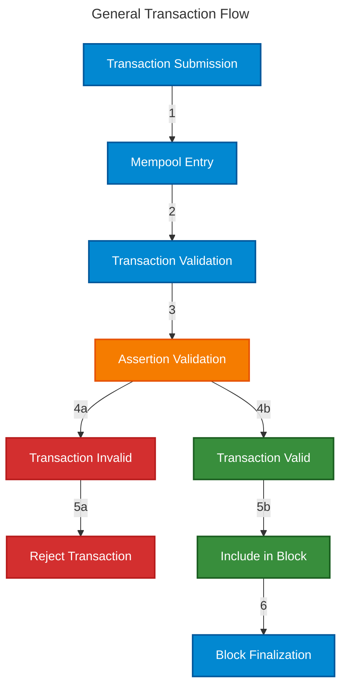
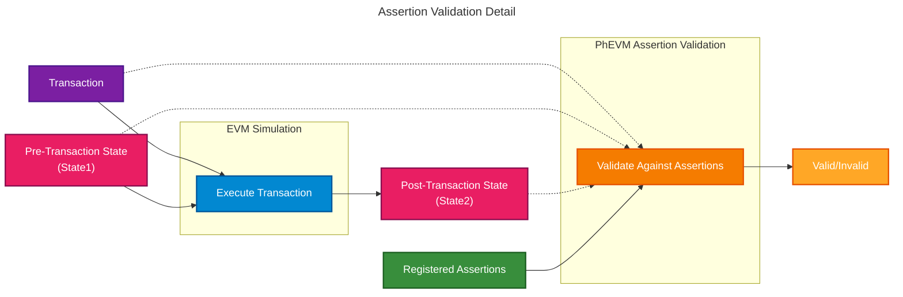
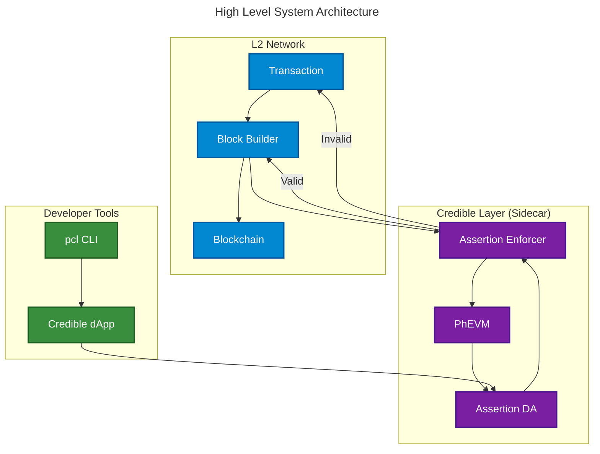

# The Phylax Credible Layer

The Credible Layer is a network extension that enables apps to define security rules and prevents transactions from violating them.

<Columns cols={2}>
  <Card title="Quickstart Guide" icon="rocket" href="/credible/pcl-quickstart">
    Get started with the Credible Layer in minutes.
  </Card>
  <Card title="Assertions Book" icon="book" href="/assertions-book/assertions-book-intro">
    See concrete assertion examples and previous hacks.
  </Card>
</Columns>

If you prefer visual learning over reading text, watch this introductory video for a comprehensive overview:

<iframe width="560" height="315" src="https://www.youtube.com/embed/J7uPS1ruR04?si=GkQEASccP6BHoPGt" title="YouTube video player" frameborder="0" allow="accelerometer; autoplay; clipboard-write; encrypted-media; gyroscope; picture-in-picture; web-share" referrerpolicy="strict-origin-when-cross-origin" allowfullscreen></iframe>

## Key Benefits

### For dApps

- **Network-Native, Rule-Based Security**: Every transaction that violates your rules is removed by the network at the sequencer level. This deterministic approach means there are no false positives
- **Easy to Use**: Written in Solidity, with foundry-like syntax, assertions are just like an in-contract require statement, but faster and more expressive. With no contract modifications or downtime during implementation
- **Transparent Security**: All active assertions are public and verifiable. Users can inspect the exact rules protecting their funds, and developers can fork proven rule sets from similar protocols

### For Networks

- **No Lock-In**: Once integrated, the Credible Layer runs natively as part of your network infrastructure - no external services required, no ongoing vendor risk
- **No throughput degradation**: Assertions are executed in parallel during sequencing. We tested a 30 megagas/s and we ran 1 gigagas/s of assertions.
- **Attract Institutional Capital**: Reduce the probability of a hack and provide easily auditable security rules, enabling more risk-averse institutions to LP

## How It Works

The Credible Layer consists of four key components working together:

1. **Assertions**: Security rules written in Solidity that define states that should never occur (e.g., "implementation address shouldn't change", "price reported by oracle shouldn't deviate more than x% inside of a single transaction").
2. **Protocols**: Protocols that define assertions for their contracts and link them on-chain.
3. **Block Builders/Sequencers**: The network infrastructure that validates every transaction against assertions before inclusion in a block, dropping any that would violate security rules.
4. **Transparency Dashboard**: A platform where users can see which protocols are protected and how, creating a focal point for ecosystem security.

## User Flow

The protocol has three target users. They can use the Credible Layer in the following ways:

1. **Protocol Teams**:
    - Install the `pcl` CLI tool
    - Write assertions in Solidity to protect their protocol
    - Test assertions locally using `pcl test`
    - Register assertions to contracts through the Credible Layer dApp
    - Monitor security posture through the dashboard
2. **End Users**:
    - View which protocols have Credible Layer protection through the dashboard
    - Verify the specific security rules protecting your funds
    - Confidently deploy their capital, knowing that malicious transactions that would result in exploits are prevented
3. **Network Operators**:
    - Run a sidecar alongside your sequencer
    - Configure integration with your infrastructure provider
    - All transactions will automatically be validated against registered assertions

## Transaction Flow

1. **Transaction Submission**: User submits a transaction to the network.
2. **Mempool Entry**: Transaction enters the mempool for processing.
3. **Transaction Validation**: The system performs basic transaction validation (signature, nonce, gas, etc.).
4. **Assertion Validation**: The system validates the transaction against registered [Assertions](/credible/glossary#assertion):
    - Identifies which assertions apply to the contracts the transaction interacts with
    - Fetches [Assertion Bytecode](/credible/glossary#assertion-bytecode) from the [Assertion DA](/credible/glossary#assertion-da-data-availability)
    - The [PhEVM](/credible/glossary#phevm-phylax-evm) simulates transaction execution and creates [pre-transaction state](/credible/glossary#pre-statepost-state) and [post-transaction state](/credible/glossary#pre-statepost-state) snapshots
    - Executes all relevant assertions against these states
    - Returns validation result:
        - If any assertion reverts (invalid state), the transaction is flagged as invalid
        - If all assertions pass, the transaction is considered valid
5. **Inclusion Decision**: The validation system makes inclusion decisions:
    - Invalid transactions are rejected and not included in the block
    - Valid transactions are included in the block
6. **Block Finalization**: The validated block is finalized and added to the blockchain.

The diagram below shows how transactions flow through the system components:

### Assertion Validation Detail

The diagram below shows what happens inside the Assertion Validation step:

Ultimately, if a transaction would result in a hack, if the contract is protected by the Credible Layer, the transaction will be dropped. If the contract is not protected, the transaction will be included in the block.

**Now you're probably thinking that forced inclusion transactions are not caught by the Credible Layer...
Well, think again! We have found a way to handle this and are actively working on implementing it.**

## System Components

### Core Infrastructure

- **Assertion Enforcer (Sidecar)**
    - Custom block builder implementation that operates as a sidecar
    - Integrates with the sequencer without requiring sequencer code modifications
    - Orchestrates the validation process by:
        - Identifying which assertions apply to incoming transactions
        - Invoking PhEVM to execute the assertions against transaction states
        - Making inclusion/exclusion decisions based on assertion results
    - Builds blocks that exclude any transactions violating assertions
    - Handles forced inclusion transactions with special mitigation pathways
    - **PhEVM (Phylax EVM) - the execution arm of the sidecar**
        - Executes assertion bytecode in an isolated off-chain environment
        - Supports special [cheatcodes](/credible/cheatcodes) (precompiles) for efficient state access and comparison
        - Can simulate both pre-transaction and post-transaction states
        - Evaluates assertions in parallel to maximize throughput
- **Assertion Data Availability (Assertion DA)**
    - Compiles and stores assertion source code and bytecode securely
    - Provides assertion code to block builders for enforcement
    - Enables transparency by making assertions publicly available
- **Credible Layer Protocol**
    - Smart contract that manages the on-chain registry of assertions
    - Maps assertions to protected contracts
    - Handles assertion registration, updates, and deactivation
    - Supports proof verification for mitigation triggers
    - Maintains security parameters and protocol metadata

The diagram above shows the high-level architecture and how all system components interact.

## Regulatory Compliance and Neutrality

*Neutrality is critical. It determines who controls the system. Who controls the system decides how the system is regulated.*

As middleware, the Credible Layer extends network capabilities without introducing new trust assumptions. Protocols define security rules through existing governance channels, and networks enforce these rules through existing mechanisms.

Networks can remove the Credible Layer anytime and still execute their core functionality. dApps can remove (or add) assertions anytime, and the system passes the off-switch test.

By avoiding centralized control points, this architecture preserves decentralization for both dApps and networks.

Policymakers are becoming increasingly aware of decentralization and see its value. Systems that quietly rely on centralized emergency controls for security risk falling on the wrong side of laws meant to capture decentralized-in-name-only projects.

Non-neutral solutions ultimately create new centralized control points: AI providers can change detection algorithms, and SaaS companies can modify security policies.

This matters because security solutions should optimally not add additional trust assumptions/risks, and they should not centralize the systems they serve.

### Developer Tools

- **Credible Layer dApp**: User interface for protocols to register and manage assertions
    - **Transparency Dashboard:** The part of the dApp that shows every project's assertions and other security measures to end users. These users can use these proofs to eliminate the blind trust that most use to make allocation decisions today.
- **`pcl` CLI**: Command-line tool for writing, testing, and deploying assertions
- **`credible-std`**: Standard library exposing cheatcodes and testing functionality for writing and testing assertions

*Screenshot of the Credible Layer dApp UI for a project*

## Use Cases

Assertions open up a wide range of use cases, some that aren't even possible in pure Solidity. Here are a few examples:

1. **Parameter Protection**: Prevent unauthorized changes to critical protocol parameters such as owner and implementation addresses.
2. **Market Integrity**: Ensure market prices don't move beyond specified thresholds inside of a single transaction.
3. **Lending Protocol Safety**: Guarantee lending positions maintain the required collateralization ratios.
4. **Oracle Monitoring**: Verify oracle prices stay within specified ranges to detect price manipulation.
5. **Total Balance Invariants**: Ensure that the sum of all positions match the total balance of a protocol.

Explore more use cases in the [Assertions Book](/assertions-book/assertions-book-intro).

## Next Steps

Ready to get started with the Phylax Credible Layer? Explore these resources:

- [Installation Guide](/credible/credible-install) - Set up your development environment and install `pcl`
- [Quickstart Guide](/credible/pcl-quickstart) - Write and deploy your first assertion using the Credible Layer
- [Cheatcodes](/credible/cheatcodes) - Detailed reference for assertion functions and capabilities
- [FAQ](/credible/faq) - Answers to common questions about the Credible Layer
