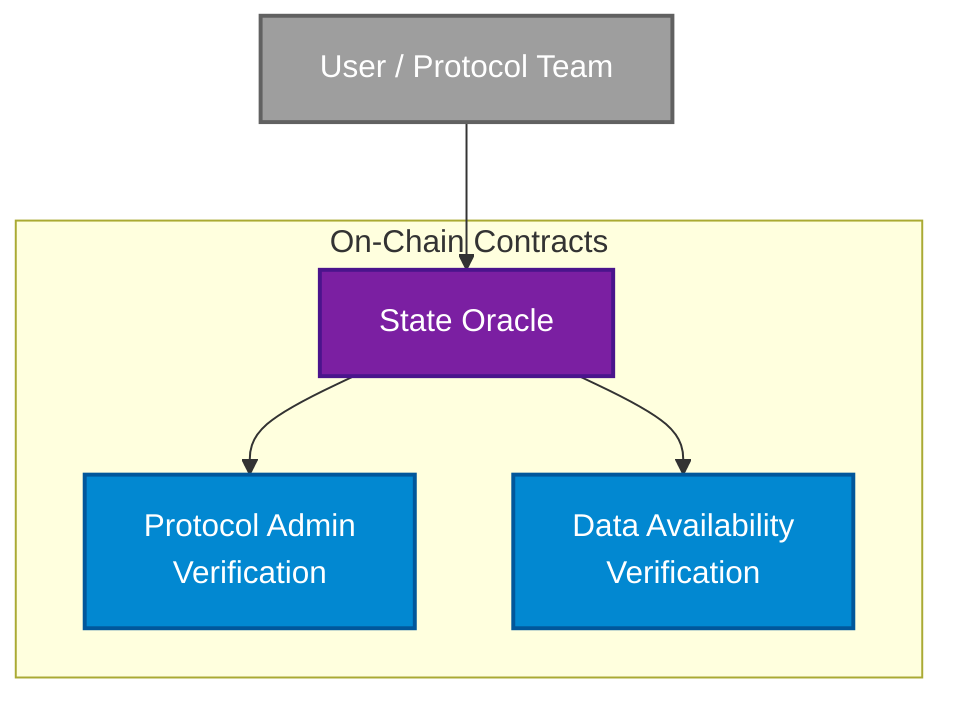

The Credible Layer Contracts are the on-chain smart contracts that power the protocol. They manage assertion registration, coordinate protocol admins with network operators, and serve as the source of truth for which assertions protect which contracts.

<Info>
The contracts are open source and available on [GitHub](https://github.com/phylaxsystems/credible-layer-contracts).
</Info>

## Components

### State Oracle

The State Oracle is the core contract that coordinates protocol admins and network operators. It maintains the mapping between protected contracts and their assertions.

**Key responsibilities:**
- Store assertion registrations for each protected contract (assertion adopter)
- Enforce timelock periods for assertion activation and deactivation
- Manage assertion windows that define when assertions are active
- Coordinate with admin verifiers to ensure only authorized parties can register assertions

**Behavior:**
- Each assertion adopter maintains a manager and a set of assertion windows
- An assertion ID can only be registered once. If removed, it cannot be re-added.
- Activation and deactivation are enforced via a configured timelock
- External admin verifiers govern who may register new adopters

The [Assertion Enforcer](/credible/assertion-enforcer) reads from the State Oracle to determine which assertions apply to incoming transactions.

View the [StateOracle.sol source code](https://github.com/phylaxsystems/credible-layer-contracts/blob/main/src/StateOracle.sol) on GitHub.

### Protocol Admin Verification

The Protocol Admin Verification interface verifies who has administrative authority over a protocol. This ensures only rightful owners can register and manage assertions for their contracts.

Admin verification is required for initial registration of an assertion adopter. The system supports multiple verification methods:
- **Owner-based verification**: Checks the `owner()` function on the target contract
- **Whitelist verification**: Allows pre-approved addresses to register

See [Ownership Verification](/credible/ownership-verification) for details on how ownership is verified.

### Data Availability Verification

The Data Availability Verification interface ensures that assertion bytecode is available before it can be registered on-chain. This prevents assertions from being registered without their bytecode being accessible to the [Assertion Enforcer](/credible/assertion-enforcer).

When adding assertions, a proof of availability must be provided. The current implementation (`DAVerifierECDSA`) requires a signature from the [Assertion DA](/credible/assertion-da) prover, which is returned when storing an assertion using [`pcl store`](/credible/cli-reference#store).

### State Oracle Administration

The State Oracle owner retains privileged controls for emergency scenarios:

- **Add or remove admin verifiers**: Adjust which verification modules are authorized
- **Register or revoke managers**: Directly manage assertion adopter permissions when necessary
- **Remove assertions**: Forcefully deactivate assertions if malicious logic is introduced or emergency removal is requested

<Warning>
These controls are intended strictly for emergency response scenarios, such as attacks or lost manager keys, and are exercised with operational safeguards.
</Warning>
