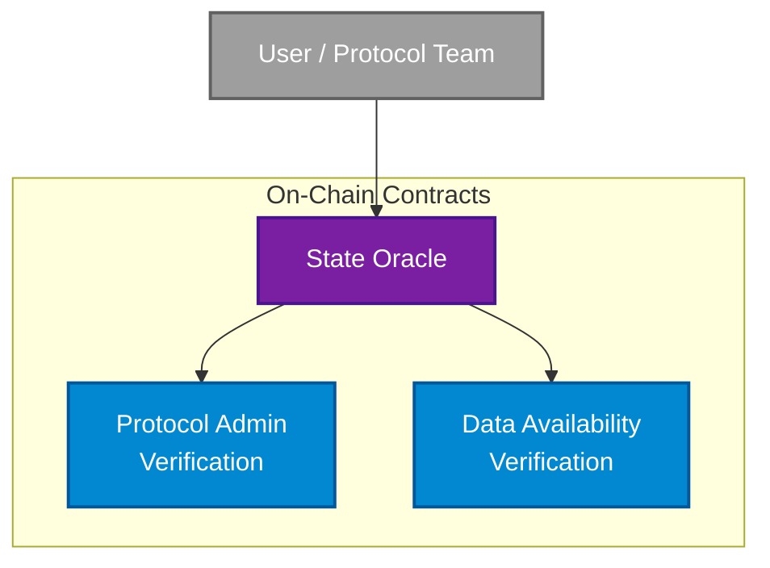

This reference describes assertion-policy contracts at `credible-layer-contracts` source revision `ba82c66118828b08416279acf91b7a0976d5535e`. Verify the deployed version and role assignments separately. The State Oracle manages assertion policy; the Ethereum [Credible Registry](./ethereum-guard-reference) separately manages block markers and builder authorization.

<Info>
The contracts are open source and available on [GitHub](https://github.com/phylaxsystems/credible-layer-contracts).
</Info>

<Note>
For how these contracts fit into the overall system, see [Interface Overview](/credible/interfaces-overview).
</Note>

## Components

```mermaid
flowchart TD
    USER["User / Protocol Team"]
    
    subgraph contracts["On-Chain Contracts"]
        SO["State Oracle"]
        AV["Protocol Admin<br/>Verification"]
        DAV["Data Availability<br/>Verification"]
    end
    
    USER --> SO
    SO --> AV
    SO --> DAV
    
    classDef user fill:#9e9e9e,stroke:#616161,stroke-width:2px,color:#fff
    classDef oracle fill:#7b1fa2,stroke:#4a148c,stroke-width:2px,color:#fff
    classDef verifier fill:#0288d1,stroke:#01579b,stroke-width:2px,color:#fff
    
    class USER user
    class SO oracle
    class AV,DAV verifier
```

### State Oracle

The State Oracle is the core contract that coordinates protocol admins and network operators. It maintains the mapping between protected contracts and their assertions, and it is the contract layer that decides when assertion changes take effect.

**Key responsibilities:**
- Store assertion registrations for each protected contract (assertion adopter)
- Enforce the configured timelock for assertion additions and removals
- Manage assertion windows that define when assertions are active
- Coordinate with admin verifiers to ensure only authorized parties can register assertions

**Behavior:**
- Each assertion adopter maintains a manager and a set of assertion windows
- An assertion ID can only be registered once per adopter. If removed, it cannot be re-added.
- Adding an assertion starts a configured timelock before it becomes staged or enforced
- Removing an assertion starts a configured timelock before it stops being staged or enforced
- External admin verifiers govern who may register new adopters

In other words, the platform and `pcl` initiate assertion changes, but the State Oracle contracts enforce the waiting period on-chain.

The [Assertion Enforcer](/credible/assertion-enforcer) reads from the State Oracle to determine which assertions apply to incoming transactions.

View the [StateOracle.sol source code](https://github.com/phylaxsystems/credible-layer-contracts/blob/main/src/StateOracle.sol) on GitHub.

### Protocol Admin Verification

The Protocol Admin Verification interface verifies who has administrative authority over a protocol. Initial authorization is separate from ongoing management through the State Oracle’s registered manager.

Admin verification is required for initial registration of an assertion adopter. The system supports multiple verification methods:
- **Owner-based verification**: Checks the `owner()` function on the target contract

Additional verification methods may be introduced over time.

See [Ownership Verification](/credible/ownership-verification) for details on how ownership is verified.

### Data Availability Verification

The Data Availability Verification interface checks the availability proof supplied at registration. A valid signature is not a guarantee of future retrieval or evaluator readiness. See [Assertion DA](./assertion-da).

When adding assertions, a proof of availability must be provided. The current implementation (`DAVerifierECDSA`) requires a signature from the [Assertion DA](/credible/assertion-da) prover, which is generated when creating a release via [`pcl apply`](/credible/cli-reference#apply).

### State Oracle Permissions

| Operation | Authority at this source revision |
| --- | --- |
| Register an adopter | Caller passes a registered admin verifier and the whitelist check when enabled |
| Add an assertion | Registered manager; whitelist check when enabled; registered DA verifier and valid proof |
| Remove an assertion | Registered manager or guardian, through their respective entry points |
| Transfer management | Current manager proposes; pending manager accepts |
| Revoke a manager | Guardian |
| Configure admin/DA verifiers, assertion limit, or whitelist enablement | Governance |
| Add or remove whitelist accounts | Operator |

Both manager and guardian removal schedule `deactivationBlock = block.number + ASSERTION_TIMELOCK_BLOCKS`; guardian removal is not immediate deactivation at this revision. Addition schedules the corresponding activation block. These block-based policy delays are separate from the Ethereum registry’s builder-administration timelock and the application guard’s fail-open threshold.

Platform collaborators do not automatically acquire any of these on-chain roles. Registry builder authorization also does not grant State Oracle management or application bypass authority.
