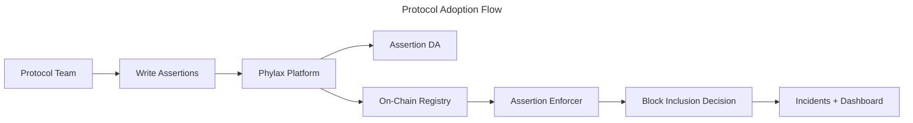

Use this page when your goal is to plan how a protocol team would adopt the Credible Layer.

<Note>
If you are ready to execute deployment, use [Deploy Assertions with the Platform](./deploy-assertions-dapp). If you need background on how the system works, start with the [Architecture Overview](./architecture-overview).
</Note>

This page outlines the minimum steps and interfaces needed to get protected.

## Adoption Workflow

Teams follow the same underlying steps. The CLI is used to author and deploy assertions, while the platform
is used to manage deployments and monitoring.

- **CLI authoring**: write assertions locally and create a release with `pcl apply`
- **Platform management**: link contracts, stage or deploy, and monitor incidents

## End-to-End Flow

## What You Control

- Which assertions protect which contracts
- Staging vs production deployments
- Incident notification routing and monitoring

## Deployment Modes

- **Staging**: test and iterate on assertions without impacting production users
- **Production**: enforce assertions at the network level for real transactions

Learn more about ownership checks in [Ownership Verification](/credible/ownership-verification).

## What Users Can Verify

- Which assertions are active for a protocol
- On-chain registry entries and transparency views
- Incident history for protected contracts

## What Successful Rollout Looks Like

- Assertions cover critical protocol invariants and admin operations
- Staging assertions are validated before moving to production
- Teams review incidents and iterate on coverage over time

## Next Steps

<CardGroup cols={2}>
  <Card title="Deploy Assertions" icon="rocket" href="/credible/deploy-assertions-dapp">
    Step-by-step deployment guide
  </Card>
  <Card title="Assertions Overview" icon="code" href="/credible/assertions-overview">
    Learn how assertions work and how to write them
  </Card>
  <Card title="Platform Overview" icon="browser" href="/credible/dapp-overview">
    Understand how the platform is used by teams and users
  </Card>
</CardGroup>
