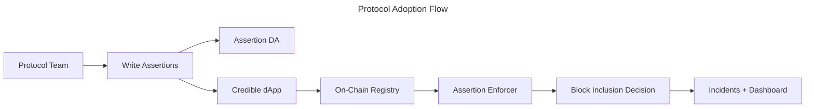

This page outlines how protocol teams adopt the Credible Layer to protect their smart contracts.
It focuses on the minimum steps and interfaces needed to get protected.

## Adoption Paths

Teams typically choose one of two paths:

- **CLI + dApp**: write assertions locally, store bytecode, and manage deployments in the dApp.
- **dApp-first**: use the dApp for project management, staging, and incident monitoring.

## End-to-End Flow

## What You Control

- Which assertions protect which contracts
- Staging vs production deployments
- Incident notification routing and monitoring

## What Users Can Verify

- Which assertions are active for a protocol
- On-chain registry entries and transparency views
- Incident history for protected contracts

## Next Steps

<CardGroup cols={2}>
  <Card title="Deploy Assertions" icon="rocket" href="/credible/deploy-assertions-dapp">
    Step-by-step deployment guide
  </Card>
  <Card title="Assertions Overview" icon="code" href="/credible/assertions-overview">
    Learn how assertions work and how to write them
  </Card>
  <Card title="dApp Overview" icon="browser" href="/credible/dapp-overview">
    Understand how the dApp is used by teams and users
  </Card>
</CardGroup>
