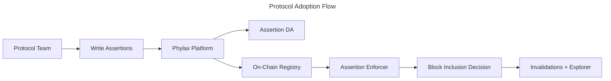

This guide shows you how to plan the platform, authorization, and rollout work for a protocol team adopting the Credible Layer.

<Note>
If you are ready to execute deployment, use [Deploy Assertions with the Platform](./deploy-assertions-dapp). If you need background on how the system works, start with the [Architecture Overview](./architecture-overview).
</Note>

Use it before deployment to identify the contracts, assertions, admins, and environments involved in the rollout.

<Note>
Project creation and assertion deployment require authorization for the target contracts. Depending on the contract and network, authorization can happen through an on-chain admin verifier such as `owner()` or through [manual verification](/credible/manual-verification).
</Note>

## Adoption Workflow

Teams follow the same underlying steps. The CLI is used to author and deploy assertions, while the platform
is used to manage deployments and monitoring.

- **CLI authoring**: write assertions locally and create a release with `pcl apply`
- **Platform management**: link contracts, stage or deploy, and monitor invalidations

## End-to-End Flow

## What You Control

- Which assertions protect which contracts
- Staging vs production deployments
- Incident notification routing and monitoring

## Coverage Planning

Before writing assertions, map the surfaces you intend to protect:

- Protected contracts and external entry points
- Privileged roles and admin operations
- Critical state variables and accounting relationships
- Oracle, bridge, vault, and downstream market dependencies
- High-risk user flows, such as borrows, withdrawals, upgrades, and parameter changes
- Known gaps that the first assertion release will not cover

This map helps the protocol team decide which assertions belong in the first release and which risks should be handled by later releases or operational runbooks.

## Authorization Requirements

Before assertions can be deployed for a contract, the platform needs to determine which protocol admin can manage that contract's assertion lifecycle. The common path is owner-based verification. If your contracts do not expose a supported ownership interface, use [How to Request Manual Verification](/credible/manual-verification) to understand the fallback process.

## Deployment Modes

- **Staging**: test and iterate on assertions without impacting production users
- **Production**: enforce assertions at the network level for real transactions

Learn more about ownership checks in [Ownership Verification](/credible/ownership-verification).

## What Users Can Verify

- Which assertions are active for a protocol
- On-chain registry entries and transparency views
- Incident history for protected contracts

## What Successful Rollout Looks Like

- Assertions cover critical protocol invariants and admin operations
- Staging assertions are validated before moving to production
- Teams review invalidations and iterate on coverage over time

## Next Steps

<CardGroup cols={2}>
  <Card title="Deploy Assertions" icon="rocket" href="/credible/deploy-assertions-dapp">
    Step-by-step deployment guide
  </Card>
  <Card title="Assertions Overview" icon="code" href="/credible/assertions-overview">
    Learn how assertions work and how to write them
  </Card>
  <Card title="Platform Overview" icon="browser" href="/credible/dapp-overview">
    Understand how the platform is used by teams and users
  </Card>
</CardGroup>
