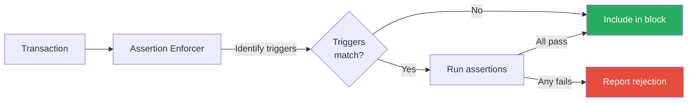
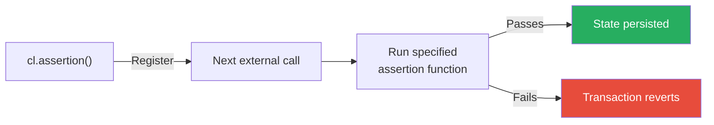

In production, the Assertion Enforcer reports assertion failures to the network integration. An enforcing integration can exclude a failing transaction before block inclusion; the executor itself reports all rejections and does not make the block-inclusion decision.

In testing, failed assertions cause **reverts**. This lets you use `vm.expectRevert()` to verify your assertion catches violations and returns the expected error message.

Understanding this difference is important for writing effective tests and interpreting their results.

## Quick Comparison

| Aspect | Testing | Production |
|--------|---------|------------|
| **When assertion fails** | Transaction reverts | Rejection reported to the network integration |
| **Which assertion runs** | Specified by `fnSelector` | All matching assertions |
| **Scope** | Next external call only | All transactions to protected contracts |

## Production: Network Integrations Apply the Result

In production, the [Assertion Enforcer](/credible/assertion-enforcer) validates transactions during block building:



Key behaviors:
- Triggers are evaluated to determine which assertions run
- All matching assertions for all interacted contracts execute
- A failing assertion produces a rejection report
- An enforcing integration can use that report to exclude the transaction before inclusion

## Testing: Transactions Revert

In testing, `cl.assertion()` registers an assertion to run on the next external call:



Key behaviors:
- You specify the assertion function via `fnSelector`, but triggers still determine if it runs
- Only the specified assertion runs, not all assertions for the contract
- Only the next external call is validated, then the registration is consumed
- Reverts simulate drops - use `vm.expectRevert()` to test failure cases

## The `cl.assertion()` Mental Model

`cl.assertion()` works like `vm.prank()` - it only affects the immediately following external call.

```solidity
// ✅ CORRECT: cl.assertion() immediately before target call
function testCorrectOrder() public {
    // Setup first
    token.mint(user, 1000);
    
    // Register assertion
    cl.assertion({
        adopter: address(protocol),
        createData: type(MyAssertion).creationCode,
        fnSelector: MyAssertion.assertionFunction.selector
    });
    
    // Target call - assertion runs here
    vm.prank(user);
    protocol.deposit(100);
}
```

```solidity
// ❌ WRONG: External call between cl.assertion() and target
function testWrongOrder() public {
    cl.assertion({...});
    
    // This call consumes the assertion registration!
    token.mint(user, 1000);
    
    // Assertion already consumed - won't run here
    vm.prank(user);
    protocol.deposit(100);
}
// Results in: "Expected 1 assertion to be executed, but 0 were executed"
```

### State Persistence

When an assertion passes, state changes persist for the rest of the test. You can assert on updated values and register subsequent assertions.

```solidity
function testStatePersistence() public {
    // First operation
    cl.assertion({...});
    protocol.deposit(100);
    
    // State from deposit persists - we can check it
    assertEq(protocol.balance(user), 100);
    
    // Register new assertion for next operation
    cl.assertion({...});
    protocol.withdraw(50);
    
    // Both operations' effects visible
    assertEq(protocol.balance(user), 50);
}
```

## Common Pitfalls

### "Expected 1 assertion to be executed, but 0 were executed"

This error means the assertion didn't run. Common causes:

1. External call between `cl.assertion()` and target - the intervening call consumed the assertion registration
2. Called function doesn't match a registered trigger - see below
3. Target transaction reverts before assertion runs - the protocol function itself fails

### Trigger Mismatch

The `fnSelector` parameter specifies which assertion function to run, but triggers are still evaluated. The assertion only runs if the next external call matches a registered trigger for that assertion function.

```solidity
// In assertion contract
function triggers() external view override {
    registerFnCallTrigger(this.assertDeposit.selector, Protocol.deposit.selector);
    registerFnCallTrigger(this.assertWithdraw.selector, Protocol.withdraw.selector);
}
```

```solidity
// ✅ CORRECT: deposit() matches the trigger for assertDeposit
cl.assertion({fnSelector: MyAssertion.assertDeposit.selector});
protocol.deposit(100);

// ❌ WRONG: withdraw() has no trigger registered for assertDeposit
cl.assertion({fnSelector: MyAssertion.assertDeposit.selector});
protocol.withdraw(50);
// Results in: "Expected 1 assertion to be executed, but 0 were executed"
```

To verify trigger behavior against recent real transactions, create a release and review its [automatic platform backtest](/credible/backtesting).

## Related Documentation

<CardGroup cols={2}>
  <Card title="Testing Assertions" icon="flask" href="/credible/testing-assertions">
    Testing patterns
  </Card>
  <Card title="Triggers" icon="bolt" href="/credible/triggers">
    Production trigger behavior
  </Card>
  <Card title="Backtesting" icon="clock-rotate-left" href="/credible/backtesting">
    Review historical findings attached to a platform release
  </Card>
  <Card title="Troubleshooting" icon="wrench" href="/credible/troubleshooting">
    Common errors
  </Card>
</CardGroup>
