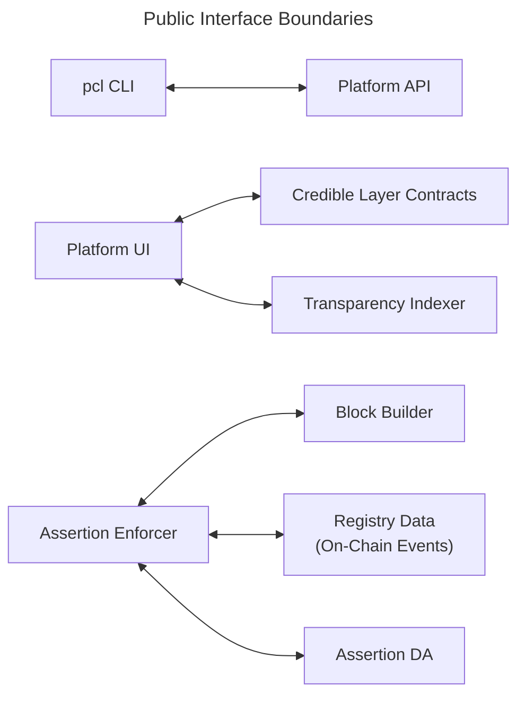

This page summarizes the public interface boundaries between Credible Layer components.
It is intentionally high-level and does not expose internal endpoints or configuration details.

## Interface Map

## What Changes Require Coordination

| Interface | Depends On | Coordinate With |
| --- | --- | --- |
| CLI ↔ Platform API | Assertion submission and auth flows | Platform + CLI maintainers |
| Platform UI ↔ Contracts | Contract ABI + events | Platform + contracts maintainers |
| Platform UI ↔ Indexer | GraphQL schema | Platform + indexer maintainers |
| Enforcer ↔ Block Builder | Transaction validation hook | Network integrators |
| Enforcer ↔ Registry | Registry events + schema | Network + contracts maintainers |
| Enforcer ↔ Assertion DA | Bytecode storage API | DA + enforcer maintainers |

## Product and Protocol Boundaries

The Credible Layer combines protocol components with Phylax-operated product surfaces. This boundary matters when evaluating trust, availability, and operational ownership.

| Component | Purpose | Layer |
| --- | --- | --- |
| Credible Layer contracts | On-chain registry, protocol admin authority, assertion windows, and timelocks | Core protocol |
| Assertion Enforcer | Executes active assertions and returns inclusion decisions during block production | Network enforcement |
| Assertion DA | Stores assertion bytecode and source code for enforcers and public verification | Phylax-operated storage today |
| `pcl` CLI | Builds, tests, authenticates, and submits assertion releases | Local developer tooling |
| Backtesting | Replays assertions against historical transactions before promotion | Phylax-operated development service |
| Staging | Runs assertions against live network activity without dropping transactions | Phylax-operated validation environment |
| Platform | Manages releases, incidents, audit logs, collaborators, alerts, and project metadata | Phylax product |

## Guidance

- Keep interface changes backward compatible when possible
- If a breaking change is needed, update all dependent components in the same release window
- Ensure public docs reflect any new interface expectations

## Related Docs

- [Architecture Overview](/credible/architecture-overview)
- [Trust Model & Guarantees](/credible/trust-model)
- [How to Plan a Platform Integration](/credible/dapp-integration)
- [Network Integration Overview](/credible/network-integration)
