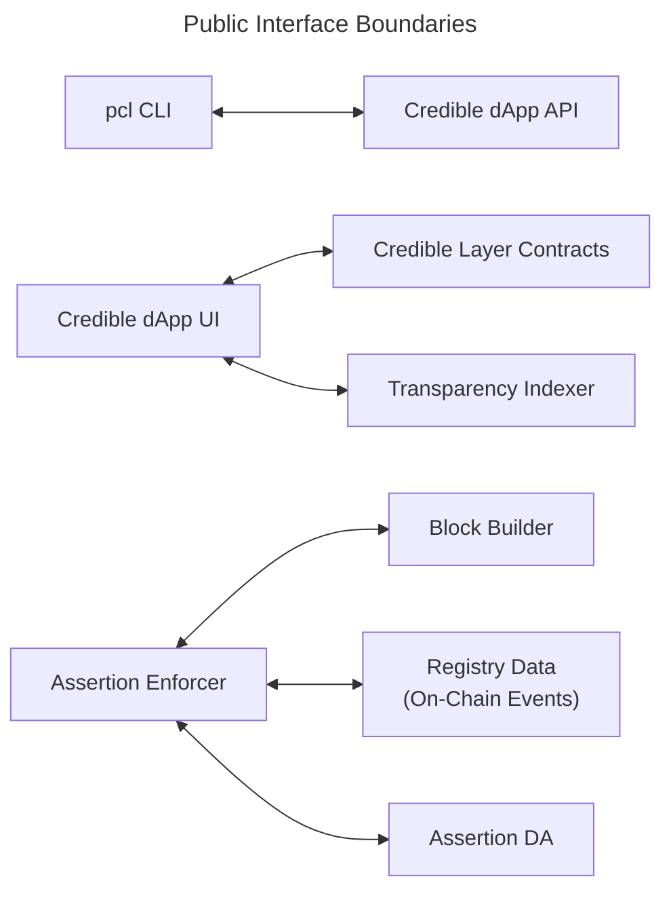

This page summarizes the public interface boundaries between Credible Layer components.
It is intentionally high-level and does not expose internal endpoints or configuration details.

## Interface Map

## What Changes Require Coordination

| Interface | Depends On | Coordinate With |
| --- | --- | --- |
| CLI ↔ dApp API | Assertion submission and auth flows | dApp + CLI maintainers |
| dApp UI ↔ Contracts | Contract ABI + events | dApp + contracts maintainers |
| dApp UI ↔ Indexer | GraphQL schema | dApp + indexer maintainers |
| Enforcer ↔ Block Builder | Transaction validation hook | Network integrators |
| Enforcer ↔ Registry | Registry events + schema | Network + contracts maintainers |
| Enforcer ↔ Assertion DA | Bytecode storage API | DA + enforcer maintainers |

## Guidance

- Keep interface changes backward compatible when possible
- If a breaking change is needed, update all dependent components in the same release window
- Ensure public docs reflect any new interface expectations

## Related Docs

- [Architecture Overview](/credible/architecture-overview)
- [Trust Model & Guarantees](/credible/trust-model)
- [dApp Integration Overview](/credible/dapp-integration)
- [Network Integration Overview](/credible/network-integration)
