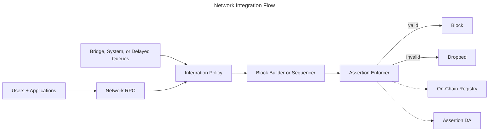

Use this page when your goal is to scope a network integration and identify the infrastructure surfaces your team will need.

<Note>
This page describes the shared integration model. Network-specific runbooks can add client, sequencer, builder, or validator details without changing the guarantees described here. If you need background first, read the [Architecture Overview](./architecture-overview).
</Note>

This page explains how networks integrate the Credible Layer at a high level. It focuses on the
interface surfaces and operational expectations without internal implementation details.

## Who This Is For

- L2 networks and sequencers evaluating integration
- Infrastructure teams operating block builders or validators
- Security teams defining network-level enforcement goals

## High-Level Flow

## Integration Surfaces

Networks provide the following integration surfaces:

- **Block-building hook**: the block builder or sequencer queries the Assertion Enforcer before including a transaction
- **Transaction-source policy**: the integration defines how user-submitted, system-originated, bridge-originated, delayed, or forced-inclusion-style transaction paths are validated
- **Result routing**: validation results are routed back into the block-building or sequencing policy that decides whether a candidate transaction can be included
- **Registry access**: the enforcer consumes registry data (indexed from on-chain events) to discover which assertions apply
- **Assertion data access**: the enforcer fetches assertion bytecode from Assertion DA
- **Operational monitoring**: invalidations, assertion status, alerting, and audit-log events are surfaced via the Phylax platform

## Integration Policy Decisions

Network integrations should define how enforcement is applied across the network's transaction paths and traffic management layers.

### Transaction Source Coverage

Some networks include transaction paths beyond ordinary user RPC flow. Examples include bridge-originated actions, delayed queues, scheduled system transactions, or forced-inclusion-style paths. The integration policy should specify how assertion validation fits into each path.

Before production rollout, define:

- Which transaction sources the integration covers
- Where assertion validation runs for each source
- Whether validation happens before admission, before inclusion, during block building, or at another documented boundary
- How validation results are routed into sequencing, block-building, or preflight policy
- Which application-layer response options protocols can use when the integration provides a response window
- Timeout and fallback behavior when validation cannot classify a transaction in time
- What invalidation metadata is sent to affected protocols

Transaction-source policy is integration-specific and should be documented before production enforcement.

### Bounded Response Windows

Some architectures can create a bounded window between detecting an unsafe transaction and the point where network rules require a final inclusion decision. If the integration uses such a window, document:

- The maximum delay or response budget
- What happens when the budget expires
- Whether the transaction is retried, released, rejected, or escalated
- Which protocol mitigations can be used, such as pausing a surface, changing a risk parameter, quarantining a known unsafe origin, or invalidating off-chain orders or intents
- What observability is required for every delayed, retried, or released transaction

The goal is bounded risk management before settlement, not an unbounded halt condition.

### Ingress traffic management

Networks can pair assertion validation with ingress-level caching and rate-limit policies for repeated invalid submissions.

Common controls include exact invalid-transaction caching, broader short-lived fingerprints for repeated attempts against the same assertion and target surface, peer or sender budgets, and clear TTLs for any broad match. Exact matches can usually be blocked aggressively; broader fingerprints should use thresholds and short expiration windows to avoid suppressing legitimate traffic.

## Operational Expectations

- The enforcer runs alongside the block builder and does not change consensus rules
- Enforcement is deterministic and only depends on on-chain state and assertion code
- Protocol teams choose whether assertions are staged or enforced; networks honor the registry status during validation
- Network operators define continuity behavior for maintenance windows, degraded dependencies, and validation timeouts
- Production integrations keep assertion work bounded through admission review, trigger scoping, runtime limits, and operational monitoring

## Integration Checklist (High Level)

- Identify the block-building hook for transaction validation
- Configure access to registry data and assertion bytecode
- Ensure the enforcer respects staged vs enforced assertions as set by protocol teams
- Define validation policy for every supported transaction source
- Define timeout, fallback, and bounded response-window behavior where applicable
- Configure ingress controls for repeated invalid submissions
- Set up monitoring and invalidation review workflows

## Integration Requirements (Public)

- **Block-building hook** that can query the enforcer before inclusion
- **Transaction-source policy** that describes where validation runs for each supported path
- **Registry access** for assertion discovery (on-chain events indexed locally)
- **DA access** for assertion bytecode retrieval
- **Invalidation visibility** through the Phylax platform

## Next Steps

<CardGroup cols={2}>
  <Card title="Architecture Overview" icon="diagram-project" href="/credible/architecture-overview">
    Detailed system architecture and transaction flow
  </Card>
  <Card title="Assertion Enforcer" icon="shield" href="/credible/assertion-enforcer">
    Sidecar validation flow and enforcement role
  </Card>
  <Card title="Trust Model" icon="shield-check" href="/credible/trust-model">
    Guarantees, trust boundaries, and operational assumptions
  </Card>
  <Card title="Invalidations" icon="warning" href="/credible/dapp-invalidations">
    Review transactions that violated assertions
  </Card>
</CardGroup>
