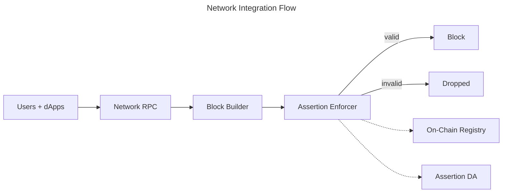

This page explains how networks integrate the Credible Layer at a high level. It focuses on the
interface surfaces and operational expectations without internal implementation details.

## Who This Is For

- L2 networks and sequencers evaluating integration
- Infrastructure teams operating block builders or validators
- Security teams defining network-level enforcement goals

## High-Level Flow

## Integration Surfaces

Networks provide the following integration surfaces:

- **Block-building hook**: the block builder queries the Assertion Enforcer before including a
  transaction
- **Registry access**: the enforcer consumes registry data (indexed from on-chain events) to discover which assertions apply
- **Assertion data access**: the enforcer fetches assertion bytecode from Assertion DA
- **Operational monitoring**: incidents and status are surfaced via the Credible dApp

## Operational Expectations

- The enforcer runs alongside the block builder and does not change consensus rules
- Enforcement is deterministic and only depends on on-chain state and assertion code
- Networks can stage assertion deployments before enforcing them in production

## Integration Checklist (High Level)

- Identify the block-building hook for transaction validation
- Configure access to registry data and assertion bytecode
- Decide on staging vs production enforcement
- Set up monitoring and incident review workflows

## Integration Requirements (Public)

- **Block-building hook** that can query the enforcer before inclusion
- **Registry access** for assertion discovery (on-chain events indexed locally)
- **DA access** for assertion bytecode retrieval
- **Incident visibility** through the Credible dApp

## Next Steps

<CardGroup cols={2}>
  <Card title="Architecture Overview" icon="diagram-project" href="/credible/architecture-overview">
    Detailed system architecture and transaction flow
  </Card>
  <Card title="Linea / Besu Integration" icon="plug" href="/credible/architecture-linea">
    Plugin-based integration pattern for Besu
  </Card>
  <Card title="Assertion Enforcer" icon="shield" href="/credible/assertion-enforcer">
    Sidecar validation flow and enforcement role
  </Card>
  <Card title="OP Stack Implementation" icon="sitemap" href="/credible/architecture-op-stack">
    OP Stack integration notes
  </Card>
</CardGroup>
