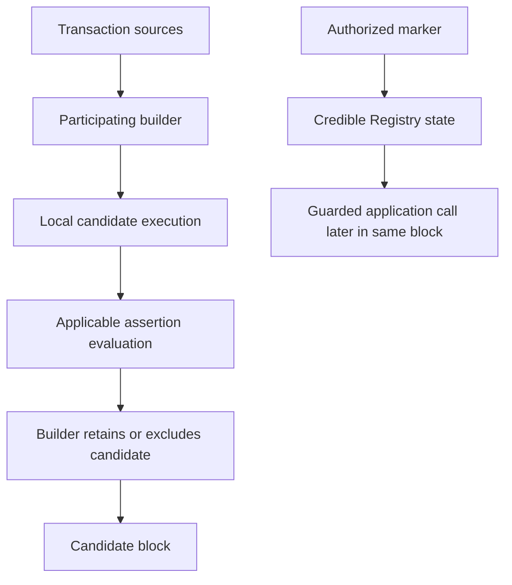

Ethereum has multiple builders. Integrating assertion evaluation into one builder does not require the others to run it. The participating-builder design combines builder evaluation with an application guard so selected actions depend on marked blocks while the guard requirement is active.

This page describes the Ethereum/Titan integration design. The [guard reference](../ethereum-guard-reference) documents a specific source revision; neither source code nor this design establishes production deployment or end-to-end readiness.

## The Enforcement Boundary

A protocol selects the functions to protect and connects them to the Credible Registry through a guard. An authorized builder submits a marker transaction earlier in the block. The guard reads the registry state written by that transaction; it does not consume the marker transaction or execute the assertions itself.

The builder must evaluate applicable active assertions for candidate transactions regardless of ingress route, including transactions obtained outside Credible RPC. It must exclude violating candidates before publishing the marked block. Otherwise, a marked block would not provide the intended assertion enforcement.

Titan’s integration design uses artifacts from its local candidate execution for assertion evaluation. The evaluator need not execute the candidate a second time. Evaluation uses state at the candidate’s proposed position; earlier RPC simulation cannot reserve that state.

## What the Marker Establishes

The registry checks marker authorization and records the current block. This establishes that an authorized marker caller marked the block. It is not cryptographic proof that every assertion ran correctly, and ordinary Ethereum consensus does not verify those off-chain checks.

Protection therefore depends on authorized marker operators honoring the evaluation policy and keeping marker transactions tied to the intended block-building flow. Registry administration, builder authorization, and application upgrade or bypass authority are distinct trust boundaries.

## Direct Guard or Adapter

With direct integration, the application uses the guard on each selected entry point. An upgradeable application must also preserve storage and upgrade authorization safety.

A supported protocol hook can instead call an assertion adapter. The adapter is the assertion adopter: the contract associated with assertions in the policy registry. The protected target may be a different contract whose state those assertions inspect. In the source implementation, `check(true)` requires the credible-block gate, while `check(false)` makes that gate optional. The adapter does not execute assertions on-chain.

A hook only establishes mandatory coverage if all relevant actions traverse it and cannot disable or bypass the gate. An arbitrary immutable contract with an unguarded alternate entry point does not acquire mandatory protection merely because an adapter exists. See [Guard and Registry Reference](../ethereum-guard-reference).

## Availability, Failure, and Recovery

While the guard requirement is active, a selected action needs a marked block. Another builder can include a transaction whose guarded call reverts; that is different from excluding the transaction before inclusion.

The generic guard has a block-gap fail-open rule. When it opens, it relaxes the credible-block requirement and restores baseline application operation. This does not mean assertions passed or equivalent protection remains. A new marker can restore the requirement. Caller bypasses and guard-specific registry read failures have separate behavior, documented in the [reference](../ethereum-guard-reference#guard-decision).

The liveness signal is global: continued marking can keep the gate active even while a particular application is selectively censored or its RPC route is unavailable. It does not detect every service outage.

## Adoption Path

Plan the protected functions and alternate paths, integrate the matching guard or adapter, establish assertion-management authority, and register supported assertions. Confirm code availability and activation before relying on enforcement. Use [Credible RPC Integration](../ethereum-rpc-integration) for pre-signing simulation and private signed submission to Titan, and [Platform Integration Planning](../dapp-integration) for release management.
