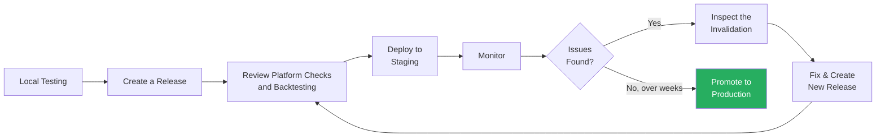

This guide shows you how to allocate assertion testing effort across local tests, platform release review, staging, and production promotion.

<Check>
**Summary**
- Local testing validates core logic; staging validates real-world behavior
- Deploy to staging early to observe behavior against real transaction flow
- Real transactions expose scenarios that are difficult to predict locally
- Review the automatic release backtest before every staging or production deployment
</Check>

## The Testing Philosophy

The most effective approach to assertion development prioritizes [staging](/credible/glossary#staging) over exhaustive local testing. In staging, assertions run against real transactions on a mirrored environment but don't affect transaction inclusion, allowing you to observe behavior safely. In [production](/credible/glossary#production), the network applies its inclusion policy to assertion validation results.

Real-world transactions reveal edge cases that would take significant effort to anticipate and mock locally.

**Why local testing has limits:**
- You can only think of so many test cases manually
- Complex protocol states are difficult to reproduce
- Setting up realistic testing environments for multi-protocol interactions is time-consuming

**Why staging excels:**
- Real usage patterns and transaction diversity
- Edge cases emerge organically from actual user behavior
- Weeks of staging exposure reveals issues that extended local testing might miss

## How to Allocate Your Time

| Phase | Effort | Goal |
|-------|--------|------|
| Local testing | ~20-30% | Validate core logic, catch obvious bugs, verify gas limits |
| Release review | ~10-20% | Review verification, source code, and automatic backtesting before deployment |
| Staging | ~50-60% | Discover edge cases, observe real-world behavior, iterate |

The bulk of your validation happens in staging. Local testing catches the obvious issues quickly so you can deploy with confidence, but staging is where you discover the edge cases.

## What to Test Locally

Focus local testing on:

- **Happy paths:** Verify assertions pass on valid transactions
- **Known violation scenarios:** Verify assertions catch the specific violations you designed for
- **Gas limits:** Ensure assertions stay within the active gas limit—3,000,000 by default—especially on the happy path (which typically uses more gas since all checks run to completion)

**What NOT to over-invest in locally:**
- Exhaustive edge case enumeration
- Complex multi-protocol interaction scenarios
- Simulating every possible user behavior

These are better discovered through staging with real transactions.

<Note>
See [Testing Assertions](/credible/testing-assertions) for local testing patterns and [Gas Limits](/credible/testing-assertions#gas-limits) for gas considerations.
</Note>

<Tip>
**Leverage existing invariant tests.** If your protocol already has Forge invariant tests, the test setup and infrastructure can often be reused for assertion testing. This can significantly reduce the time spent on local test configuration.
</Tip>

## Review platform backtesting before staging

When you create a release with `pcl apply`, the platform runs three release checks: assertion verification, source code, and backtesting. The backtesting service tests every assertion in the release against transactions from the last 20,000 blocks.

Open the release in the platform and review the backtesting result before you authorize a deployment. A passing result means the release did not invalidate any transaction in the tested window. An **Issue found** result identifies a historical transaction that the assertion would have prevented from settling.

For each finding, inspect the matched transaction, assertion ID, adopter, incident payload, previous transactions, and block environment. If the transaction is benign, tune the assertion and create a new release so the platform can check the updated assertion set. If you cannot explain a finding, do not deploy the release.

See [How to Review Backtesting Results](./backtesting) for the investigation workflow and [Release Review Checks](./release-review-checks) for the complete release-check reference.

## The Staging Workflow

### Deploy Early

Once local tests pass and you have reviewed every platform release check, [deploy to staging](/credible/deploy-assertions-dapp). Don't wait for "perfect" local coverage—staging will reveal what you missed. Note that deployments have a [timelock](/credible/glossary#timelock) period before assertions become active, so starting early is beneficial.

### Monitor Staging Behavior

Check the [platform dashboard](https://app.phylax.systems) regularly for assertion execution status and enable [invalidation notifications](/credible/dapp-integrations) to get alerted via Slack or PagerDuty. Look for:

- Unexpected invalidations on legitimate operations
- Assertion behavior that needs tuning before production

Staging runs assertions but does NOT drop transactions, so you can observe behavior without risk.

### Investigate staging invalidations

When an issue appears in staging:

1. Identify the transaction that triggered unexpected behavior
2. Open the invalidation in the platform and inspect its assertion result, trace, and execution context
3. Add a focused local regression test that reproduces the assertion behavior
4. Fix the issue, create a new release, and review its automatic backtesting result

<Tip>
**Add regression tests for discovered edge cases.** When staging or platform backtesting reveals an unexpected scenario, create a local unit test that reproduces the behavior. This prevents regressions and builds a test suite informed by real-world usage patterns rather than speculation.
</Tip>

### Recommended Staging Duration

- **Minimum:** 1-2 weeks before considering production
- **High-traffic protocols:** More transactions means faster feedback
- **Low-traffic protocols:** May need longer staging periods

The goal is sufficient transaction diversity, not a specific timeframe. As the developer, you are best positioned to judge when your assertions have been validated against enough real-world scenarios to warrant promotion to production.

## When to Move to Production

Before promoting to production, verify:

- Expected behavior observed on legitimate transactions
- Sufficient transaction diversity to build confidence
- You reviewed every finding from the platform's automatic release backtest
- Trigger frequency, runtime, and gas usage fit the network's production limits
- You understand how the assertion behaves across different scenarios

<Warning>
Moving to production means assertion results can affect transaction inclusion according to the network's policy. Ensure you have validated behavior thoroughly in staging before promoting.
</Warning>

## Common Mistakes

**Over-investing in local testing:** Trying to cover every edge case locally is inefficient. Staging does this better with real transactions.

**Skipping the release backtest:** Review the automatic platform result and investigate every finding before authorizing deployment.

**Deploying directly to production:** Always validate in staging first. Production should only use assertions that have passed staging review.

**Expecting immediate feedback:** Edge cases may take weeks to appear in staging. Be patient and let real usage patterns emerge.

## Next Steps

<CardGroup cols={2}>
  <Card title="Testing Assertions" icon="flask-vial" href="/credible/testing-assertions">
    Local testing patterns and best practices
  </Card>
  <Card title="Backtesting" icon="clock-rotate-left" href="/credible/backtesting">
    Review the automatic backtest attached to a platform release
  </Card>
  <Card title="Deploy with the Platform" icon="rocket" href="/credible/deploy-assertions-dapp">
    Deploy assertions to staging or production
  </Card>
  <Card title="Troubleshooting" icon="wrench" href="/credible/troubleshooting">
    Common errors and solutions
  </Card>
</CardGroup>
